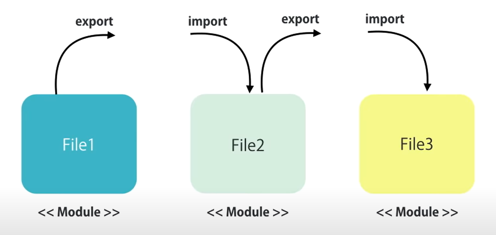
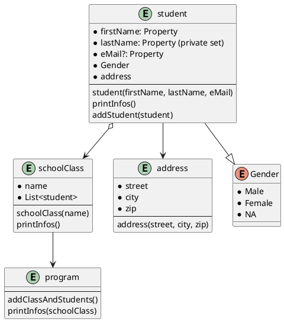

# Basics

Dieses Kapitel erklärt in kurzen Absätzen die Grundlagen von Node.js, und TypeScript

## Node.js


Node.js ist eine plattformübergreifende Entwicklungsumgebung, die nicht im Browser ausgeführt wird. Anders gesagt, JavaScript kann damit am Server ausgeführt werden (Back End). Node ist dabei keine eigene Programmier- oder Script-Sprache, es ist lediglich ein Container (`Node.exe`, geschrieben in C++) in dem Java Script ausgeführt werden kann. Hierfür kam Googles v8-Engine zum Einsatz (weitere wären: Chakra für Edge, SpiderMonkey für Firefox).

Im erstenMoment klingt das eigenartig. Warum JavaScript am Server, wo es doch tolle Programmiersprachen (C#, Java, ...) gibt.

**Vorteile**:
* Viele Frontendentwickler, können nun auch am BackEnd arbeiten.
* Prototyping: Ideal für Prototypen, die relativ zeitnah erstellt werden müssen.
* JavaScript nun sowohl am Server, als auch am Client.
* Viele Open Source Libraries.

Node wird also verwendet um TypeScript Code zu interpretieren. Node stellt dafür einen Transpiler (Achtung, nicht Compiler) zur Verfügung, der TypeScript in JavaScript transpiliert. Letztlich kann ein Browser und auch Node nur JS-Code ausführen.

## TypeScript, JavaScript, ECMAScript

### ECMAScript

*ECMAScript* ist die Skriptsprache, auf welcher JavaScript basiert. [*ECMA International*](https://www.ecma-international.org) ist mit der Normung von ECMAScript befasst.

### JavaScript

Java Script basiert auf ECMAScript. ECMAScript definiert den Standard, den JavaScript erfüllt. JavaScript kann also all dies und gegebenenfalls noch etwas mehr.

### TypeScript

TypeScript ist ein Superset, also eine Erweiterung von JavaScript. TypeScript kann also alles was JavaScript auch kann und noch etwas mehr. Man könnte also problemlos in einem TS-File JavaScript Code schreiben. Node könnte das interpretieren.

Wir erinnern uns, auch Node führt nur JS Code aus. Der TS Code wird also zu JS transpiliert. Man kann das mit Programm Code und Intermediate Language einer Programmiersprache (C#, Java) vergleichen.

Weiterführende Links für Interessierte:

* https://www.typescriptlang.org
* https://developer.mozilla.org/de/docs/Web/JavaScript
* https://www.ecma-international.org

### tsc

Folgendes ist das Node-Kommando mit dem man ein TS-File in ein JS-File transpiliert. (``tcs <filename>.ts``)

```powershell
tsc demo.ts
```

Dies erstellt das File `demo.js` im selben Verzeichnis.

Vorteile von TS sind nun z.B.:
* **Strong Typing**: Ähnlich wie in C# oder Java kann man in TS Datentypen definieren. Das bringt Vorteile wie z.B....
* **Compile Time Errors**: Durch die strenge Typisierung können Fehler bereits zur Entwurfszeit/Kompilierzeit in der IDE angezeigt werden. Sie treten also nicht, wie bei JS, erst zur Laufzeit auf.
* **Object Oriented Features**: Das objektorientierte Konzepte wie Vererbung, Interfaces, Polymorphismus, Konstruktoren, ... ist umgesetzt
* **Tooling**: Umfangreiches Tool Set durch Node.js

### Beispiele TS:

Folgendes TS...

TS:
```typescript
function logMessage(message) {
    console.log(message)
}

let message='Hello World!';

logMessage(message);
```

...erstellt folgendes JS:

JS:
```javascript
function logMessage(message) {
    console.log(messages);
}
var message = 'Hello World!';
logMessage(message);
```

Die beiden Files sind also bis auf Zeilenumbrüche ident.

Ausführen kann man das JS-File mit `node <filename>.js`:

```powershell
node demos.js
```

Gehen wir nun zu den Unterschieden:

Ersetzen wir mal `var` durch `let`. `let` gibt es in ES5 nicht, daher wird es von Node durch `var` ersetzt. `var` hat den Scope der nächsten function, `let` jenen des nächsten Blocks. Anders gesagt: `var` gilt in der gesamten function, `let` nur innerhalb des `for`-Blocks. Das führt in TS zu einem Fehler zur Entwurfszeit. Node erstellt dennoch das JS-File. Es ist sogar lauffähig.

TS:
```typescript
function log() {
    for (let i = 0 ; i< 5 ; i++) {
        console.log(i)
    }
    console.log('Final: ' + i)
}

log();
```
**Achtung!!**

JS: Die Variable ``i`` wird in der Zeile ``console.log('Final' + i)`` rot unterwellt sein.

Das erstellte JS-File dazu:

JS:
```javascript
function log() {
    for (var i = 0 ; i< 5 ; i++) {
        console.log(i)
    }
    console.log('Final: ' + i)
}
log();
```

`let` wurde durch `var` ersetzt.

### Typisierung

Die Typisierung ist jener zu C# sehr ähnlich. Die Syntax ist vielleicht etwas gewöhnugsbedürftig.

Wird kein Datentyp explizit angegeben, ist der Default-Datentyp ``any``. Er ist mit var in C# vergleichbar. Zur Kompilierzeit wird er festgelegt.

Einige Beispiele:

TS:
```typescript
function demos() {
    let a = 5;              // wird als Number festgelegt
    let b;                  // Wird asl any festgelegt
    let c:string;           // Wird als string festgelegt
    let d = 'Hello World!'  // Wird asl string festgelegt

    let e = 12;
    e = 'Hello World!'      // Liefert hier einen Fehler, nicht aber in JS

    console.log(a);
}
demos();
```

TS:
```typescript
firstName
```

``firstName`` ist nun mit `any` initialisiert.

Explizite Typisierung:

TS:
```typescript
firstName: string
```

Beispiel ``any``:

TS:
```typescript
function demos() {
    let a = 5;
    a = 'Hello World!'
    console.log(a);
}
demos();
```

Liefert einen Kompilierfehler, ist aber gültig in ES5 und würde ausgeführt werden.

JS:
```javascript
function demos() {
    var a = 5;
    a = 'Hello World!';
    console.log(a);
}
demos();
```

Wie in C# ist es ratsam sich von Anfang an auf Datentypen festzulegen.

### Enum

Bekannt aus C#:

TS:
```typescript
enum Colours {Red, Blue, Green}
let backgoundColor = Colours.Blue
```

Das erstellte JS-File ist etwas weniger gut lesbar:

JS:
```javascript
var Colours;
(function (Colours) {
    Colours[Colours["Red"] = 0] = "Red";
    Colours[Colours["Blue"] = 1] = "Blue";
    Colours[Colours["Green"] = 2] = "Green";
})(Colours || (Colours = {}));
var backgoundColor = Colours.Blue;
```

### Intellisense

Durch die strenge Typisierung erhalten wir bereits zur Entwurfszeit Kompilierungsfehler in der IDE. Aber nicht nur das. Dadurch ist auch das bekannte Intellisense aus Visual Studio möglich. Durch die Typisierung weiß der Compiler ja welche Felder, Methoden, Konstruktoren, Properties der Typ zur Verfügung stellt.

### Arrow Functions

Bereits aus C# bekannt, die Lambda Expressions. Ein ähnliches Konstrukt gibt es in TS. Hier ist der Name *Arrow Function*:

Eine klassische Methode...

TS:
```typescript
let log = function(x) {
    console.log(x);
}
```

...als Arrow Function

TS:
```typescript
let log = (x) => console.log(x);
```

### Class, Interface

Arrow Functions können schnell mehrere bis viele Parameter enthalten. Das sollte vermieden werden. Die Lösung bietet z.B. ein Interface:

weniger gut:

TS:
```typescript
let log = function(firstName, lastName, eMail, d, e, f, g, h) {
    console.log(firstName + ' ' + lastName + ' ' + eMail);
}
```
besser:

TS:
```typescript
let log = function(person: Person) {
    console.log(person.firstName + ' ' + person.lastName + ' ' + person.eMail);
}
```

mit dem Interface-Typ `Person`. Das führt uns zwangsweise zum Kapitel Klassen und Interfaces, die wir in TS wie aus C# oder Java gewohnt, auch hier zur Verfügung haben.

### Klassen und Interfaces

Für die vorherige Korrektur benötigen wird einen eigenen Typ.

TS:
```typescript
interface Person {
    firstName: string,
    lastName: string,
    eMail: string,
    d, e, f, g, h

    // writeFullName() {...} kann es in Interfaces nicht geben
}
```

Nachteil am Interface: Man kann keine Methoden implementieren. Die Lösung wäre eine Klasse zu definieren.

TS:
```typescript
class Person {
    firstName: string;
    lastName: string;
    eMail: string;

    // writeFullName() {...}
}
```

### Konstruktor

Ebenfalls sind Konstruktoren möglich. Pro Klasse gibt es nur einen Konstruktor. Er kann beliebig viele Parameter enthalten. Möchte man nicht alle Parameter beim Aufruf angeben, kann man sie optional setzten. Dafür werden sie einfach mit einem Fragezeichen am Ende versehen `(a, b, c, d?, e?, f?)`. Alle Parameter links neben dem ersten optionalen Parameter müssen ebenfalls optional sein. (Wie in C#)

TS:
```typescript
constructor(firstName: string, lastName: string, eMail?: string) {
    this.firstName = firstName
    this.lastName = lastName
    this.address = new Address('Spengergasse');
}
```

### Properties

Wie in Java werden Get- und Set-Methoden geschrieben:

TS:
```typescript
class Person {
    private lastName: string;

    getLastName() {
        return this.lastName;
    }

    setLastName(value) {
        if (value == '') {
            throw Error('Nachname ist ein Pflichtfeld!');
        }
        this.lastName = value;
    }
}
```

Zu einem Property wird dies indem man den Get/Set-Methodennamen durch ein Leerzeichen "auftrennt":

TS:
```typescript
class Person {
    private lastName: string;

    get LastName() {
        return this.lastName;
    }
    set LastName(value) {
        if (value == '') {
            throw Error('Nachname ist ein Pflichtfeld!');
        }
        this.lastName = value;
    }
}
```

### Modules

Prinzipiell ist ein Modul ein File. Klassen darin werden als Module exportiert, damit sie in anderen Files (als Module) verwendet werden können. Files können natürlich mehrere Klassen enthalten. Es wird dann aus einer Klasse ein Modul mit dem Keyword `export` exportiert.



```typescript
export class Person { }
```

Nun kann das Modul in einem anderen File importiert werden.

Z.B.: ``main.ts`` importiert nun das Modul ``Person``. Der Filename in der Zeile `import` ist der Name des TS-Files indem das Modul exportiert wird. Die Extension muss entfallen. Der Pfad kann relativ geändert werden.

Mit dem `new`-Keyword wird einen neue Instanz der Klasse `Person` erstellt. Alles weitere ist aus der Objektorientierung bekannt.

```typescript
import { Person } from './person';

let person = new Person('Martin', 'NoName');
person.LastName = 'Schrutek';
person.eMail = 'schrutek@spengergasse.at';
person.writeInfo();
console.log(person.address.street);
```

### Die ganzen Klassen

TS:
```typescript
export class Person {
    private firstName: string;
    private lastName: string;
    eMail: string;
    address: Address;

    constructor(firstName: string, lastName: string, eMail?: string) {
        this.firstName = firstName
        this.lastName = lastName
        this.address = new Address('Spengergasse');
    }

    writeInfo() {
        console.log(this.firstName + ' ' + this.lastName + ' ' + this.eMail)
    };

    get FirstName() {
        return this.firstName;
    }

    get LastName() {
        return this.lastName;
    }

    set LastName(value) {
        if (value == '') {
            throw Error('Nachname ist ein Pflichtfeld!');
        }
        this.lastName = value;
    }
}
class Address {
    street: string;

    constructor(street: string) {
        this.street = street;
    }
}
```

```typescript
import { Person } from './person';

let person = new Person('Martin', 'NoName');
person.LastName = 'Schrutek';
person.eMail = 'schrutek@spengergasse.at';
person.writeInfo();
console.log(person.address.street);
```

Es werden mittels Node folgende JS's transpiliert:

JS:
```javascript
"use strict";
exports.__esModule = true;
exports.Person = void 0;
var Person = /** @class */ (function () {
    function Person(firstName, lastName, eMail) {
        this.firstName = firstName;
        this.lastName = lastName;
        this.address = new Address('Spengergasse');
    }
    Person.prototype.writeInfo = function () {
        console.log(this.firstName + ' ' + this.lastName + ' ' + this.eMail);
    };
    ;
    Object.defineProperty(Person.prototype, "FirstName", {
        get: function () {
            return this.firstName;
        },
        enumerable: false,
        configurable: true
    });
    Object.defineProperty(Person.prototype, "LastName", {
        get: function () {
            return this.lastName;
        },
        set: function (value) {
            if (value == '') {
                throw Error('Nachname ist ein Pflichtfeld!');
            }
            this.lastName = value;
        },
        enumerable: false,
        configurable: true
    });
    return Person;
}());
exports.Person = Person;
var Address = /** @class */ (function () {
    function Address(street) {
        this.street = street;
    }
    return Address;
}());
```

```javascript
"use strict";
exports.__esModule = true;
var person_1 = require("./person");
var person = new person_1.Person('Martin', 'NoName');
person.LastName = 'Schrutek';
person.eMail = 'schrutek@spengergasse.at';
person.writeInfo();
console.log(person.address.street);
```

## Fazit

C# gewöhnte Entwickler haben eher weniger Schwierigkeiten sich an TS zu gewöhnen, da die Ähnlichkeiten auf der Hand liegen. Auch hier ein hilfreiches Werkzeug auf dem Weg vom BackEnd- oder FrontEnd-, zum FullStack-Entwickler.

## Auf dem Weg zu Angular

Die hier besprochenen Strukturen werden wir in Angular wiederfinden. Wenn man diese Grundlagen verstanden hat, ist es leichter sich im vermeintlichen "Angular-Dschungel" zurechtzufinden. In Wirklichkeit ist Angular, auch dadurch, sehr gut strukturiert.

Ich greife hier deutlich vor und zeige noch eine Klasse9, wie sie in Angular verwendet würde:

```typescript
import { Component } from "@angular/core";

@Component({
    selector: 'app-products',
    templateUrl: 'products.component.html',
    styleUrls: ['products.component.css']
})
export class ProductsComponent {
    title: string = 'Products Works!!'

    getTitle() {
        return this.title;
    }

    getProducts() {
        return [ 
            { name: 'Product A', price: 10.12 },
            { name: 'Product B', price: 12.54 },
            { name: 'Product C', price: 5.85 },
            { name: 'Product D', price: 53.60 } ]
    }
}
```

Wir finden den Import-Block, den Export-Block, Felder und Methoden. Diese Klasse verfügt über aber keine Properties oder Konstruktor. Lediglich neu: `@Component({ ... })`. Aber dazu mehr später.

## Übung

Es sind 3 Klassen zu implementieren ``program``, ``schoolClass``, ``student``



#### Student:
* ``lastName`` ist ein Pflichtfeld, wenn ``null`` soll ein Error geworfen werden.
* ``printInfo`` soll alle Daten in einer frei gestaltbaren Zeichenfolge in der Konsole ausgeben.

#### SchoolClass:
* ``addStudent`` soll einen Student der Liste hinzufügen.
* ``printInfo`` soll alle Daten in einer frei gestaltbaren Zeichenfolge in der Konsole ausgeben.

#### Program:
* ``printInfo`` soll die Infos der Klasse und die Infos aller Studenten ausgeben.
* ``addClassAndStudents`` soll eine Klasse mit einem beliebigen Namen (z.B. 5CHIF) und 3 Studenten mit beliebigen Daten der Klasse hinzufügen.
* Die beiden Methoden ``printInfo`` und ``addClassAndStudent`` sollen aufgerufen werden.
