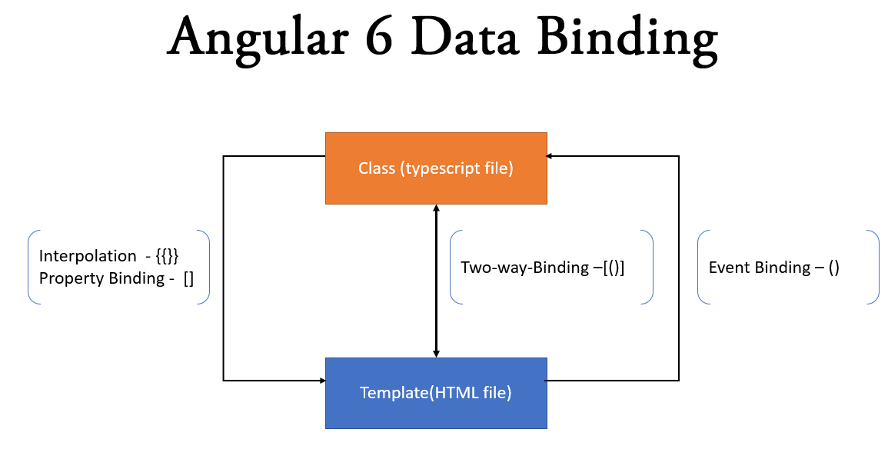

# Aufbau einer Angular App

Eine Angular Applikation besteht aus Modulen, Komponenten und Services.


## Module

Module enthalten Komponenten (Mehrzahl). Es gibt immer ein Hauptmodul, das App-Modul (``app.module.ts``) Dieses kann (wird sicher) Komponenten enthalten. Es kann aber auch weitere Untermodule enthalten, die ihrerseits wiederum Komponenten enthalten können. Services sind in einem anderen Scope verfügbar. Sie stehen außerhalb dieser Hierarchie, und werden über Dependency Injection in dem jeweiligen Modul instanziiert. Dann haben sie in dieser Komponente Gültigkeit.

## Komponenten

Komponenten bestehen aus drei Teilen:

### 1. dem HTML-Template (.html)

Das HTML-Template enthält HTML, welches die Komponenten darstellen wird.

```html
<h3><strong>Schüler Details</strong></h3>

<div>
  <h2>{{schueler?.vorname}} {{schueler?.name}}</h2>
  <dl>
    <dt>ID:</dt>
    <dd>{{schueler?.id}}</dd>

    <dt>Name:</dt>
    <dd>{{schueler?.name}}</dd>

    <dt>Vorname:</dt>
    <dd>{{schueler?.vorname}}</dd>
  </dl>
</div>
```

### 2. dem Type-Script FIle (.ts)

Das Type Script File enthält die Programmlogik der Komponente (Felder Properties, Methoden, ...)

```typescript
import { Component, OnInit, Input } from '@angular/core';
import { SchuelerDto } from 'src/app/models/schuelerDto';

@Component({
  selector: 'app-schueler-details',
  templateUrl: './schueler-details.component.html',
  styleUrls: ['./schueler-details.component.css']
})
export class SchuelerDetailsComponent implements OnInit {

  @Input()
  public schueler: SchuelerDto;

  constructor() { }

  ngOnInit() {
  }
}
```

Komponenten werden mit dem Decorator `@Component` versehen, dem sog. Meta Data. Hier werden die wichtigsten Blöcke definiert, die die Komponente benötigt.

```typescript
@Component({
  selector: 'app-schueler-details',
  templateUrl: './schueler-details.component.html',
  styleUrls: ['./schueler-details.component.css']
})
```

### 3. das CSS-File (.css)

Im CSS File sind jene CSS-Formatierungen angegeben, die das HTML in der Komponente betreffen.

Diese 3er-Konstellation ist gekapselt!

Ein Komponenten-Baum kann nun z.B. so aussehen:


## Bindings

Informationen müssen auf irgendeine Weise vom ts-File an das html-File weitergegeben werden, und zurück. Das geschieht über das Data Binding.



Es gibt Interpolations, Two-Way-Binding und Event-Binding.

Das Interpolations Binding wird durch {{ }} gekennzeichnet. Information wird an das html-Template gegeben.

Das Two Way Binding wird durch [( )] gekennzeichnet. Informationen werden an das Template gegeben und wieder zurück. Z.B. html-input.

Das Event-Binding wird durch [] gekennzeichnet. Die Information geht als Event vom html-Template an das ts-File. Z.B. ein Button wird geklickt.

# Ein neues Projekt anlegen

siehe 01_Installation

## `bootstrap` und `jquery` installieren

Wir müssen als erstes folgende Libraries installieren:

```Powershell
npm install --save bootstrap
npm install --save jquery

z.B. `npm install --save bootstrap@3` für eine spezielle Bootstrap-Version.

...bzw. die "types" dazu:

npm install --save @types/bootstrap
npm install --save @types/jquery
```

## Konfigurationen von "angular.json" und "tsconfig.app.json" anpassen

`angular.json`:

```json
"styles": [
  "./node_modules/bootstrap/dist/css/bootstrap.min.css",
  "src/styles.css"
],
"scripts": [
  "./node_modules/jquery/dist/jquery.min.js",
  "./node_modules/bootstrap/dist/js/bootstrap.min.js"
],
```

`tsconfig.app.json`:

```json
"types": [
  "bootstrap",
  "jquery"
]
```

Das App-Module muss nun folgende Imports beinhalten:

```typescript
import { BrowserModule } from '@angular/platform-browser';
import { NgModule } from '@angular/core';
 
import { AppComponent } from './app.component';
 
@NgModule({
  declarations: [
    AppComponent
  ],
  imports: [
    BrowserModule
  ],
  providers: [],
  bootstrap: [AppComponent]
})
export class AppModule { }
```

## `bootstrap-icons` installieren

```Powershell
npm install --save bootstrap-icons
```

Anschließend im File *styles.css* die URL zu bootstrap-icons hinzufügen:

```css
@import "~bootstrap-icons/font/bootstrap-icons.css";
```

### Verwendung

```html
<h1>
  <span class="bi bi-star"></span>
</h1>
```

## Eine Erste eigene Komponente erstellen

Erstellen wir nun eine Home-Komponente. Später werden wir auch einen Routing-Mechanismus implementieren, der unter anderem auf die Home-Komponente Routen wird. Die Komponente soll dabei wie die "Startseite" der Applikation  darstellen.

Die Komponente kann man übe die CLI mit folgendem Kommando generieren lassen:

```powershell
ng g component home
```

Wir erhalten:


Wie bereits erwähnt, sind das die wichtigsten Teile einer Komponente. Betrachten wir nun den Decorator des ts-Files im Detail:

```typescript
@Component({
  selector: 'app-home',
  templateUrl: './home.component.html',
  styleUrls: ['./home.component.css']
})
```

1. `selector`: (String) Der CSS-Selector gibt den Namen der Komponente an. Dieser teilt Angular mit, eine Instanz der Komponente zu generieren, wo immer im html der Selector gefunden wird.

2. `templateUrl`: (String) Enthält den Pfad zum html-Template. Es wäre auch möglich das html direkt in diesen String zu schreiben und kein separates File zu generieren.

3. `styleUrls`: (Array) Enthält die CSS-Files, die diese Komponente betreffen.

### Das app.module

Um die Komponente zu verwenden sind nun noch Änderungen im App-Modul notwendig. Komponenten müssen im darüber liegenden Modul (wenn kein eigenes Modul erstellt wurde, gibt es zumindest IMMER das App-Modul) bekannt gemacht werden.

```typescript
import { BrowserModule } from '@angular/platform-browser';
import { NgModule } from '@angular/core';

import { AppComponent } from './app.component';
import { HomeComponent } from './home/home.component';

@NgModule({
  declarations: [
    AppComponent,
    HomeComponent,
  ],
  imports: [
    BrowserModule,
  ],
  providers: [
  ],
  bootstrap: [AppComponent]
})
export class AppModule { }
```

Um die Komponente direkt als Startseite anzuzeigen, kann man gleich den Selector in der `app-component.html` verwenden.

z.B.: so:

```html
<div class="container container-fluid">
    <div class="row">
        <app-home></app-home>
    </div>
</div>
```
