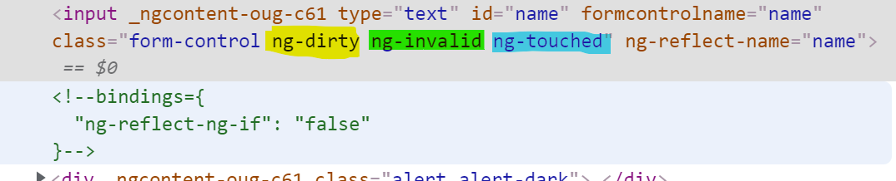

# Reactive Forms

Reactive Forms bieten deutlich mehr Flexibilität, was die Gestaltung und die Validierung der Eingaben betrifft.

Die `FormControls` werden im TS-File erstellt und mit allen nötigen Settings und Validatoren vorsorgt. Ausgehend von einer FormGroup wird diese mit den `FormControl`'s befüllt. Diese wiederum erhalten die nötigen Settings.

## Validation

Gehen wir gleich direkt zur Validation (interessant Teil) und beginnen wir mit dem HTML:

```html
<form [formGroup]="productItemForm" (ngSubmit)="onSubmit()">
  <input type="text" id="name" formControlName="name" class="form-control" (change)="onChange(name)">
  <div *ngIf="name.pending">
    checking for uniques...
  </div>  
  <div *ngIf="name.invalid && (name.dirty || name.touched)" class="alert alert-dark">
    <div *ngIf="name.errors?.['required']">
      Name is required.
    </div>
    <div *ngIf="name.errors?.['maxlength']">
      Name must be max. 10 characters long.
    </div>
  </div>

  <input type="text" id="price" formControlName="price" class="form-control">
  <div *ngIf="price.invalid && (price.dirty || price.touched)" class="alert alert-dark">
    <div *ngIf="price.errors?.['required']">
      Price is required.
    </div>
  </div>

  <br>
  
  <button class="btn btn-success" type="submit">Save</button>
</form>
```

Folgendes hat sich offensichtlich geändert:

* An die Form wird eine `FormGroup` gebunden. Diese wird im TS-File instanziert.
* Manche Attribute entfallen, eines kommt dazu: `formControlName="name"`
* Der Block der Fehlermeldungen (`div`'s) bleibt unverändert.

Wir haben also weniger Codeaufwand im HTML, müssen aber dafür den Rest der Arbeit im TS-File erledigen.

Es wird ein Member für die Form benötigt:

```typescript
public productItemForm: any;
```

Im Konstruktor wird nun ein FormBuilder injected. Achtung! Auf das entsprechende `imports` nicht vergessen.

```typescript
constructor(private formBuilder: FormBuilder) { }
```

**Next Step**: Es muss (wie bereits oben erwähnt) die FormGroup und die FormControl's erstellt werden:

```typescript
ngOnInit(): void {
this.productItemForm = new FormGroup({
  name: new FormControl(this.productItem.name, [
    Validators.required,
    Validators.maxLength(10)
  ]),
  price: new FormControl(this.productItem.price, Validators.required)
  });
}
```

Hier nun ein *helfender* Teil: Um die Felder im HTML leichter ansprechen zu können, ist es durchaus hilfreich dafür Properties zu generieren (`this.productItemForm.get('name')` => `name`).

```typescript
  get name() { return this.productItemForm.get('name'); }
  get price() { return this.productItemForm.get('price'); }
```

aus:

```html
... *ngIf="productItemForm.get('name').invalid && (name.dirty || productItemForm.get('name').touched)" ...
```

kann nun werden:

```html
... *ngIf="name.invalid && (name.dirty || name.touched)" ...
```

## Custom Validators

### ProductNameValidator.cannotContainSpace

Erstellen wir dazu eine neue Klasse:

```typescript
export class ProductNameValidator {
  static cannotContain2Spaces(control: AbstractControl) : ValidationErrors | null {
    if ((control.value as string).indexOf('  ') >= 0) {
      return { cannotContain2Spaces: true };
    }
    return null;
  }
}
```

Dieser Validator prüft, ob im Produktnamen (`name`) ein Leerzeichen eingegeben wurde. 

* Die Methode muss statisch sein
* Es wird das `ValidatorFn`-Interface implementiert: https://angular.io/api/forms/ValidatorFn

Den erstellten Validator in der `FromGroup` hinzufügen.

```typescript
ngOnInit(): void {
this.productItemForm = new FormGroup({
  name: new FormControl(this.productItem.name, [
    Validators.required,
    Validators.maxLength(6),
    ProductNameValidator.cannotContain2Spaces
  ]),
  price: new FormControl(this.productItem.price, Validators.required)
  });
}
```

Notwendige Erweiterung im HTML:

```html
<div *ngIf="name.errors?.['cannotContain2Spaces']">
  Name contains 2 Spaces.
</div>
```

### Async Validators (ProductNameValidator.productNameMustBeUnique)

Wir wollen nun den Produktnamen überprüfen. Er muss unique sein. Dazu ist natürlich eine API-Abfrage notwendig. Wir simulieren deren Latenz das durch ein Timeout.

Dazu ist es notwendig einen weiteren Validator zu schreiben. Da die Prüfung asynchron erfolgen soll (während man eingibt wird bereits geprüft) muss ein anders Interface implementiert werden (`AsyncValidatorFn`: https://angular.io/api/forms/AsyncValidatorFn).

Dieses returniert ein Promise. Die Vorgehensweise ist also etwas anders. Die Methode erstellt ein Promise in dessen `resolve`-Teil die, eigentliche Validierung stattfindet. Ist dieser Teil erledigt, wird das Ergebnis zurückgegeben.

Dieses Beispiel called (der Einfachheit halber) keine API. Es wird hard coded ein bestimmter Name überprüft. (*laptop* darf nicht eingegeben werden). Das Timeout simuliert die API-Latenz (z.B. 2 Sek.).

```typescript
static productNameMustBeUnique(control: AbstractControl): Promise<ValidationErrors | null> {
  return new Promise((resolve, reject) => {
    setTimeout(() => {
      if ((control.value as string).toLowerCase() === "laptop") {
        resolve({ productNameMustBeUnique: true});
      }
      else {
        resolve(null);
      }
    }, 2000);
  });
}
```

Notwendige Erweiterung im HTML:

```html
<div *ngIf="name.errors?.['productNameMustBeUnique']">
  Product name already exists.
</div>  
```
Den erstellten Validator in der `FromGroup` hinzufügen.

```typescript
ngOnInit(): void {
this.productItemForm = new FormGroup({
  name: new FormControl(this.productItem.name, [
    Validators.required,
    Validators.maxLength(6),
    ProductNameValidator.cannotContainSpace
  ], [
    ProductNameValidator.productNameMustBeUnique 
  ]),
  price: new FormControl(this.productItem.price, Validators.required)
  });
}
```

## Display Loader Text/Image

Bei asynchronen Validierungen ist manchmal ein Loader-Text ganz hilfreich (`Benutzername wird geprüft, bitte warten...`)

`ngModel` hilft uns auch hier mit einem Property, welches durch Angular gesetzt wird (`pending`). Man muss also nur direkt unter das input-Field ein weiteres `div` mir der Meldung oder Image legen:

```html
<input type="text" id="name" formControlName="name" ...>
<div *ngIf="name.pending">
  checking names, please wait...
</div>  
```

## `input`-Tag optisch gestalten

Eine weitere einfache Möglichkeit ist es auch, bei einer Falscheingabe das entsprechende input-Tag optisch umzugestalten. z.B. mit einem roten (statt blauen) Rahmen.

Angular setzt bei einer Eingabe in das `class`-Attribut weitere Klassen, je nachdem ob die Eingabe richtig order falsch ist.



Diese Tags werden von Angular gesetzt und können mit *css* versorgt werden. Das ist übrigens der Unterschied zwischen Bootstrap und Angular-Bootstrap. Angular-Bootstrap verfügt über die entsprechende css-Klassen. Man muss diese nicht mehr selbst gestalten.

Wir können das hier dennoch tun. Im *css*-File der Komponente wird folgendes ergänzt:

```css
.form-control.ng-dirty.ng-invalid {
  border: 2px solid red
}
```

Bei Falscheingaben erscheint nun der Rahmen in roter Farbe.

## Übung

Es ist ein Formular zu entwickeln mit dem das Kennwort geändert werden kann. Das Formular besteht aus 3 Eingabefeldern und einem Submit-Button.

**Eingabefelder**:

* **Altes Kennwort**: Die Eingabe ist erforderlich und sie muss mit einem bestehen (hard coded im Validator) Kennwort verglichen werden. Die Eingabe muss übereinstimmen.
* **Neues Kennwort**: Die Eingabe ist erforderlich. Das Kennwort muss mindestens 8 Zeichen lang sein und ein Sonderzeichen enthalten.
* **Kennwort wiederholen**: Die Eingabe ist erforderlich und das eingegebene Kennwort muss mit jenem aus dem Feld *Neues Kennwort* übereinstimmen.

Der Submit-Button soll nach click das neue Kennwort in der Konsole ausgeben.