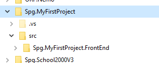
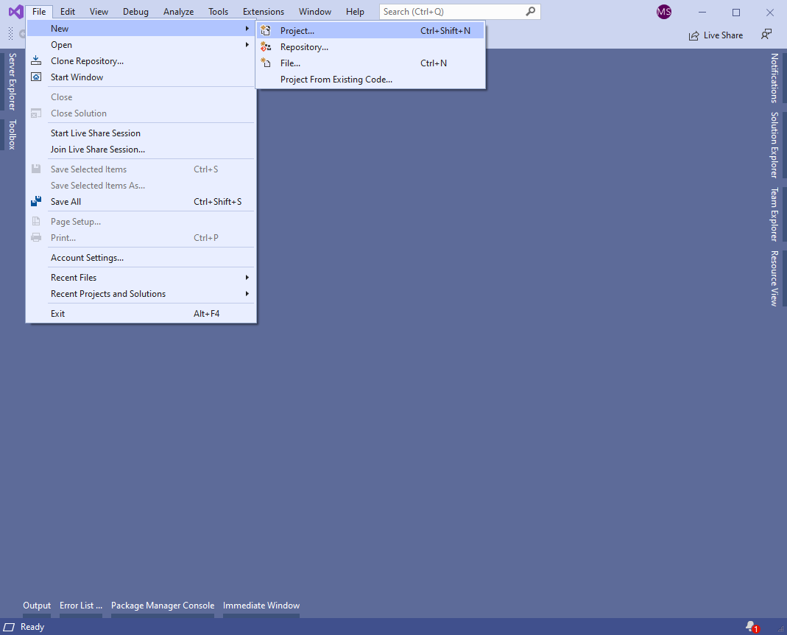
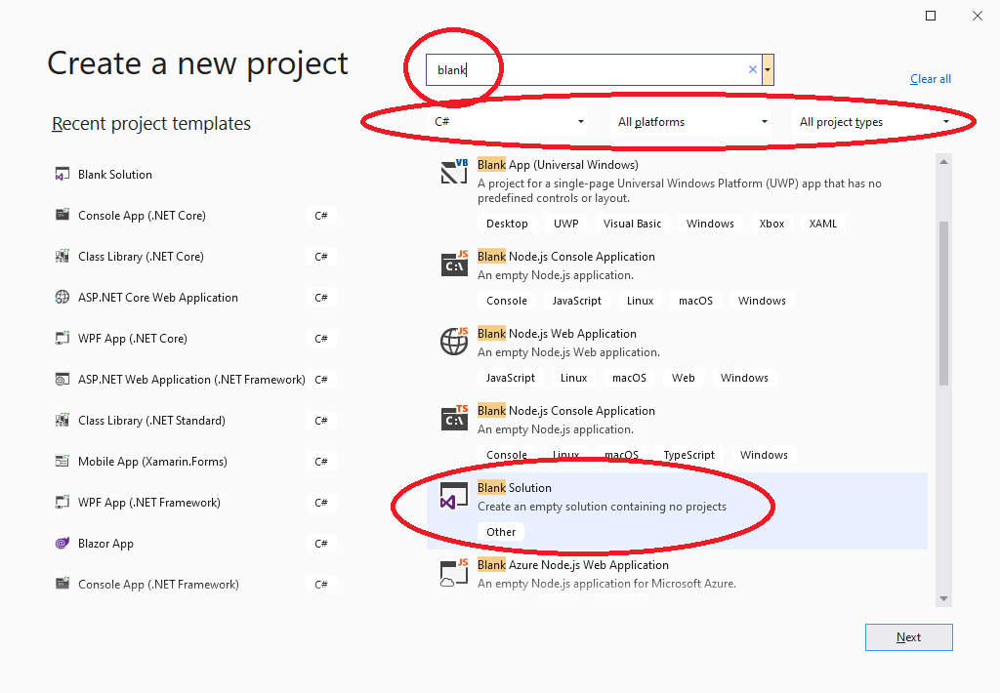
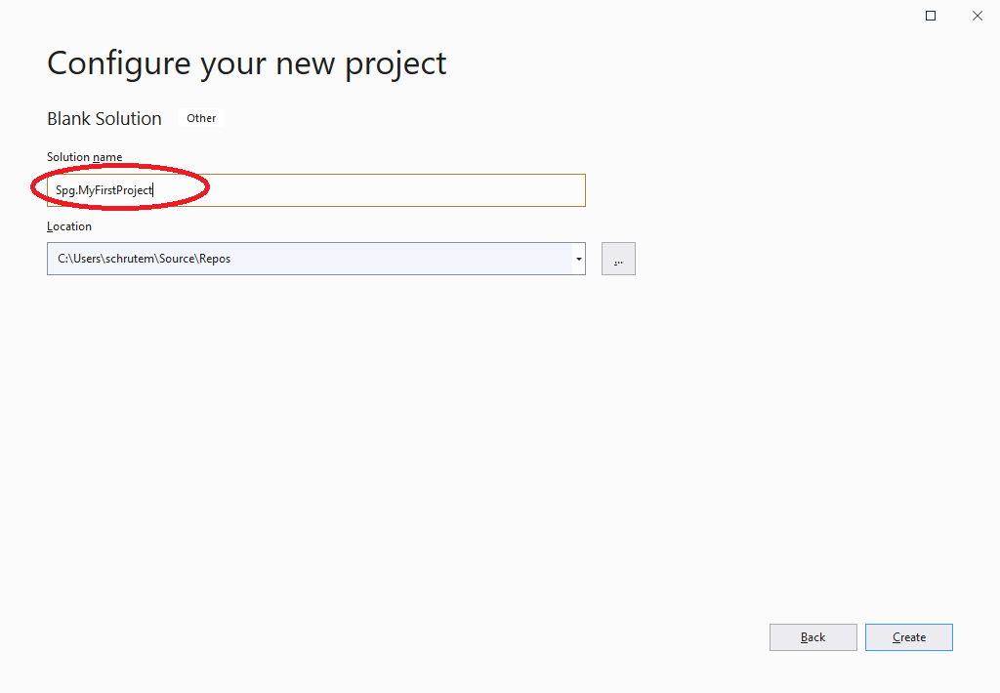
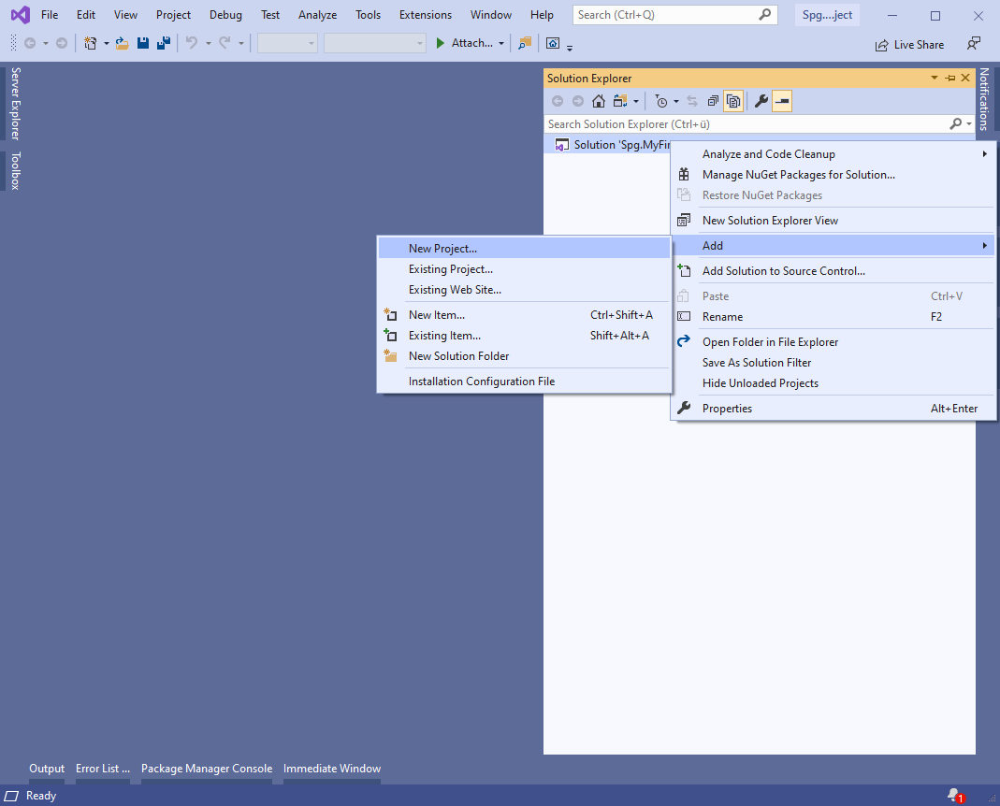
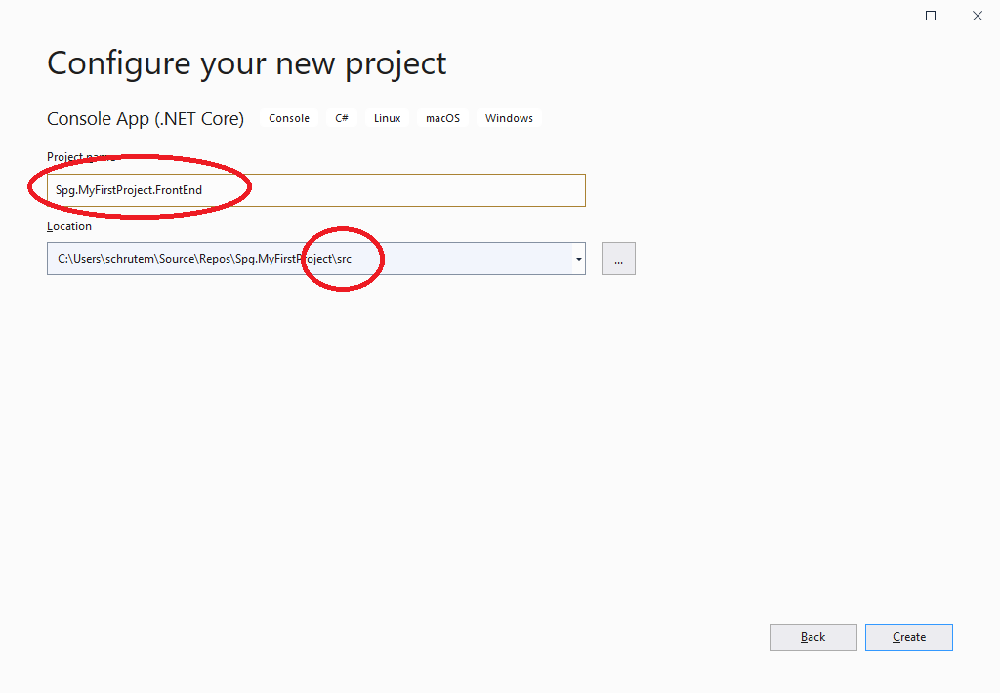

# Aufbau einer Solution

Es hat sich folgender Aufbau einer Solution als sinnvoll und übersichtlich erwiesen. Dabei gibt es eine root-Folder in dem das Solution-File steht. darunter ein Verzeichnis ``src`` in dem die einzelnen Projkete einer Soltuion platz finden. Eine Solution besteht in der Regel aus mehreren Projekten (z.B. einer WPF-Anwendung für das User Interface und mehreren Class Libraries in denen die Business-Logik verbaut ist).

Visual Studio begrüßt uns gleich nach start mit der Option ein neues Projekt anzulegen. Wir entscheiden uns erstmal dagegen.

Aber nun legen wir doch ein neues Projekt an.

Zuerst eine leere Solution erstellen

Nach Konvention ist die Benennung einer Solution ``[Firmenname].[Projektname]``

Anschlie0end  ein Projekt in die Solution erstellen

Nach Konvention ist die Benennung eines Projketes ``[Firmenname].[Projektname].[Projektteilname]``. Ein Projektteilname ist z.B. FrontEnd, Services, BusinessLayer, DataLayer, ...

Das ist nun das Ergebnis

