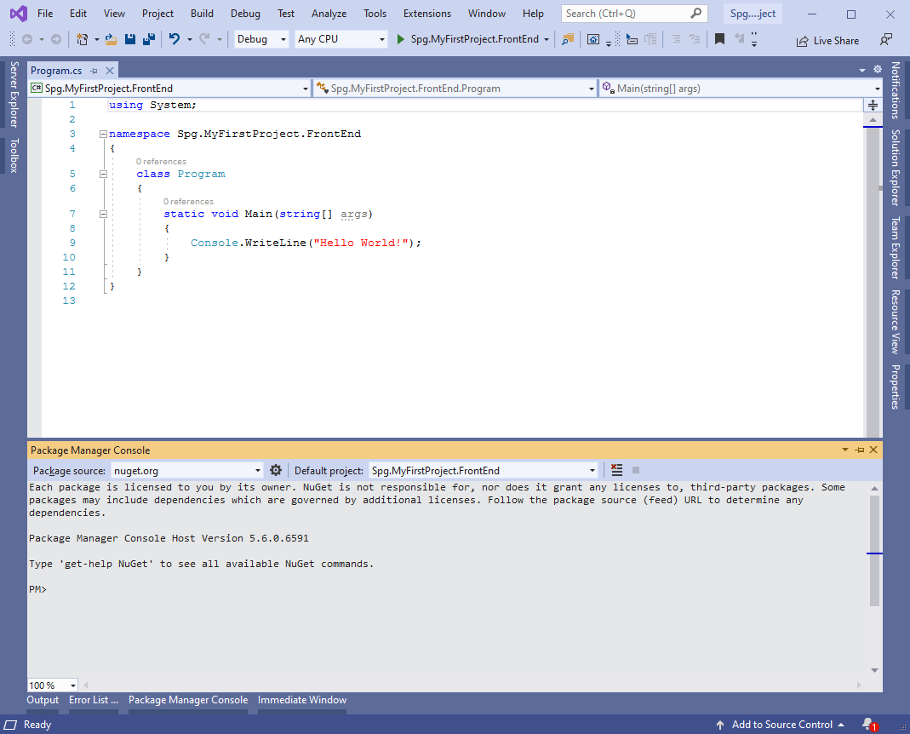
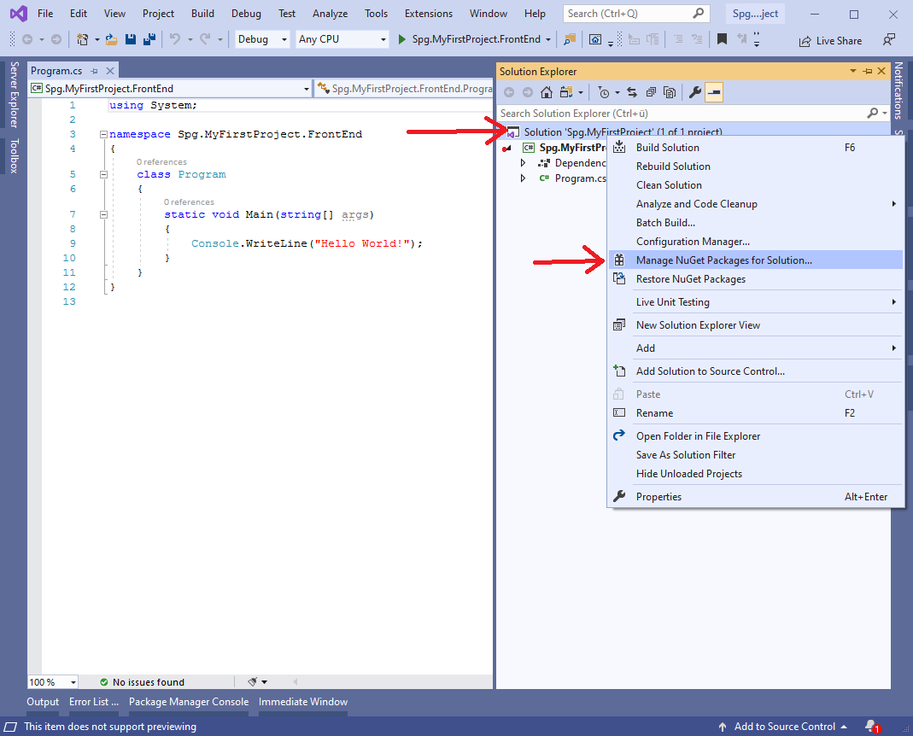
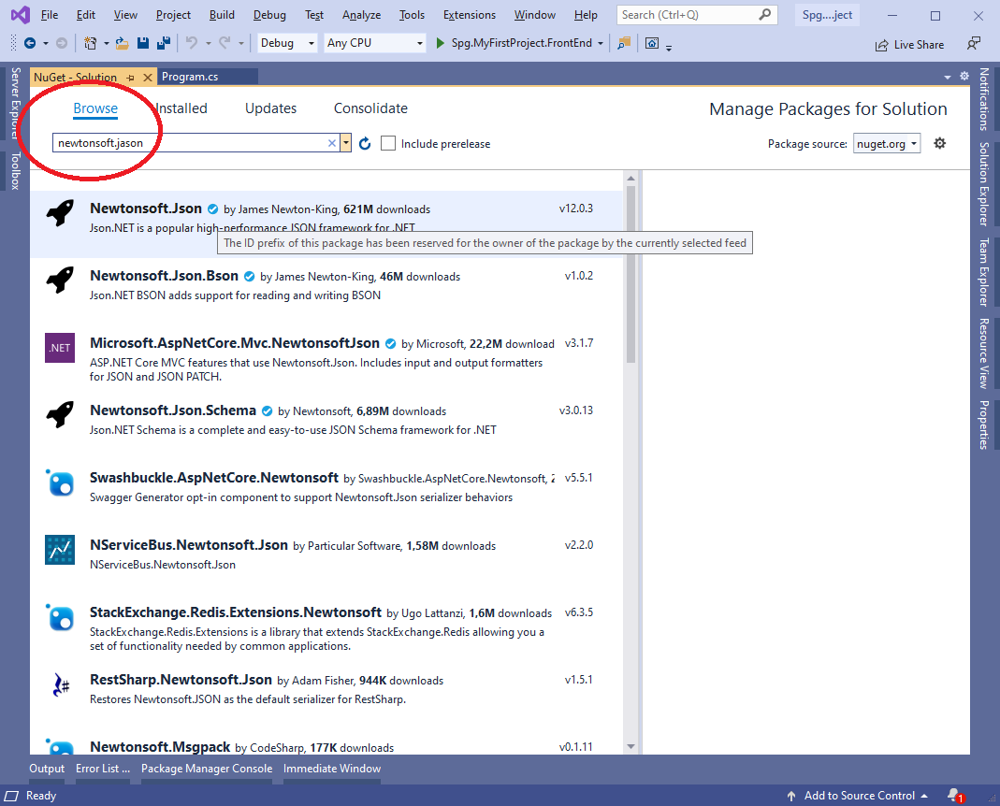

# Grundlagen

## Intallation

Details dazu auf der Seite von Michael Schletz:

https://github.com/schletz/Pos3xhif/blob/master/VisualStudioInstallation.md

## Unterschiede C# / Java

**Was es in Java auch gibt**:

* Object-orientation (single inheritance)
* Interfaces
* Generics (more powerful than in Java)
* Exceptions
* Threads
* Namespaces (similar to Java packages)
* Attributes (similar to Java annotations)
* Garbage collection
* Reflection
* Dynamic loading of code

**Was neu ist**:

* Reference parameters
* Stack-allocated objects (structs)
* Uniform type system
* goto statement
* Delegates
* System-level programming
* Versioning
* Partial Types
* Lambda expressions
* Extension methods
* Anonymous types

**Syntaktische Annehmlichkeizten**:

* Component-based programming
  * Properties
  * Events
* Indexers
* foreach loop
* Iterators
* SQL-like query expressions

## Kewords

abstract, as, base, bool, break, byte, case, catch, char, checked, class, const, continue, decimal, default, delegate, do, double, else, enum, event, explicit, extern, false, finally, fixed, float, for, foreach, goto, if, implicit, in, int, interface, internal, is, lock, long, namespace, new, null, object, operator, out, override, params, private, protected, public, readonly, ref, return, sbyte, sealed, short, sizeof, stackalloc, static, string, struct, switch, this, throw, true, try, typeof, uint, ulong, unchecked, unsafe, ushort, using, virtual, void

## Wertetypen / Referneztypen

Das wird in C# ähnlich wie in Java behandelt, aber dazu mehr später...

## Enumerations

Enumerations sind Listen von benannten Aufzählungen.

Die Deklaration erfolgt so:

```C#
public enum MyColor
{
    Red = 0,

    Green = 1,

    Blue = 2,

    Yellow = 3,

    Unknown = 99
}
```

Die Verwendung auf folgende Weise:

```C#
public void WriteMyColor()
{
    MyColor myColor = MyColor.Blue;
    Console.WriteLine(myColor);
}
```

## Classes

Objekt werden in C# wie in Java behandelt.

### Boxing / Unboxing

Eine Besonderheit ist das sog. Boxing und unboxing. Hier kann, wenn es der Datentyp zulässt, ein Wertetyp in einen Refereztyp umgewandelt (geboxt ("eingeschachtelt")) werden und umgekehrt (unboxing). Das ist manchmal ganz praktisch, sollte aber mit Bedacht und nur selten verwendet werden, da es recht Laufzeitintensiv ist, weil der Speicherinhalt vom Heap in den Stack umgespeichert werden muss und umgekehrt! In diesem Beispiel wird ein Int-Objekt in einen Int umgewandelt.

Alle Objekte leiten von ``object`` ab und können natürlich zu diesem gecastet werden. (Mehr zu Vererbung später)

```C#
public void ExampleWithObject()
{
    Console.WriteLine("*** ExampleWithObject ***");

    Rectangle rectangle = new Rectangle(30, 50);

    object rectangleObject = rectangle;

    int myValue = 3;

    object myObject = 5;

    myValue = (int)myObject;

    Console.WriteLine(myValue);
}
```

## Structs

* Structs sind Wertetypen, sie werden am Stack, nicht am Heap abgelegt.
* Structs sind Speichersparender als Objekte aus Klassen.
* Weil es Wertetypen sind, können Structs nicht ``NULL`` sein.
* Structs können nicht vererbt werden und können nicht erben
* Structs können Interfaces implementieren.
* Structs können keinen Default-Konstruktor enthalten.
* Structs müssen nicht unbedingt mit new Instanziert werden.

```C#
public void UseAStruct()
{
    Console.WriteLine("*** UseAStruct ***");

    Point p;
    //p = new Point(3, 4);    // Der Konstruktor initialisiert ein Objekt am Stack.

    // field access
    p.x = 1;
    p.y = 2;

    // method call
    p.MoveTo(10, 20);

    Point q = p;

    Console.WriteLine($"STRUCT Q: {q.x}, {q.y}");
}
```

## Die Klasse String

Die String-Klasse ist ein Referenztyp, hat aber einige Besonderheiten:

* Sie kann über das ``=``-Zeichen instanziert werden:

```C#
string name = "Alfonso";
```

* Die Klasse String ist "immutable". Für komplextere Strings bitte die Klasse ``StringBuilder`` verwenden.
* Mit ``+`` können Strings einfach aneinander gefügt werden. !Für komplextere Strings bitte die Klasse ``StringBuilder`` verwenden!
* Zeichen können mit ``myString[i]`` lokalisiert werden.
* Strings sind zwar Referenztpen, können aber mit ``==`` oder ``!=`` verglichen werden. In C# gibt es die Möglichkeit Operatoren zu überladen (mehr dazu süpäter).

!!Für komplextere Strings bitte die Klasse ``StringBuilder`` verwenden!!

Beispiele:

```C#
string name = "Alfonso";
Console.WriteLine(name);

name = "Don" + " ";
Console.WriteLine(name);

name = name + "Alfonso";
Console.WriteLine(name);

Console.WriteLine(name[4]);

Console.WriteLine(name.Length);

if (name.Substring(0, 3).ToLower() == "don")
{
    Console.WriteLine("ja, ist Don");
}
else
{
    Console.WriteLine("nein, ist was anderes");
}

string lastName = "Bauer";
Console.WriteLine("Hello {0} {1}", name, lastName);
Console.WriteLine($"Hello {name} {lastName}");

Console.WriteLine("C:\\HTL\\3AHIF\\Readme.md");
Console.WriteLine(@"C:\HTL\3AHIF\Readme.md");

Console.WriteLine(
    @"Lorem ipsum dolor sit amet, consetetur sadipscing elitr, sed diam nonumy eirmod 
tempor invidunt ut labore et dolore magna aliquyam erat, sed diam voluptua. At vero eos et accusam 
et justo duo dolores et ea rebum. Stet clita kasd gubergren, no sea takimata sanctus est Lorem 
ipsum dolor sit amet.

Lorem ipsum dolor sit amet, consetetur sadipscing elitr, sed diam nonumy 
eirmod tempor invidunt ut labore et dolore magna aliquyam erat, sed diam voluptua. At vero eos 
et accusam et justo duo dolores et ea rebum. Stet clita kasd gubergren, no sea takimata sanctus 
est Lorem ipsum dolor sit amet."
    );

// Hier wird, wie obenbeschrieben direkt in die Konsole geschreieben. Das gleiche geht auch direkt mit String-Objekten:

string myfirstLineText = String.Format("Hello {0} {1}", name, lastName);
string myPath = String.Format(@"C:\HTL\3AHIF\Readme.md");
```

## Parameter

* ``value parameter``: **"call b value"** Der Wert wird in der Methode erhöht, der Parameter vom Aufrufer ändert sich aber nicht. Der vorherige Parameter wird kopiert.
* ``ref parameter``: **"call by reference"** Der Wert wird in der Methode erhöht, der Parameter vom Aufrufer ändert sich. Es wird die Speicheradresse des vorherigen Parameters kopiert.
* ``out parameter``: Ähnlich wie ``ref``, aber der Parameter Aufrufer gibt keinen Parameter an die Methode.

## Methodenüberladungen

**Grundsätzlich gilt:** eine Methoden mit gleicher Sigbatur darf nur einmal vorkommen. Es kann aber eine Methode mit gleichem Namen öfter vorkommen, dann müssen aber die Parameter unterschiedlich sein.

```C#
public void PrintName()
{
    Console.Out.WriteLine($"Hello {FirstName} {LastName}!");
}

public void PrintName(bool greeting)
{
    if (greeting)
    {
        Console.Out.WriteLine($"Hello {FirstName} {LastName}! (overridden)");
    }
    else
    {
        base.PrintName();
    }
}
```

## Konstruktoren

* Konstruktoren könen ebefalls beliebig überladen werden (wie in Java).
* Ein Konstruktor kann einen anderen aufrufen
* Befor ein Konstrultor aufgerufen wird, werden die Felder initialisiert.

### Default-Konstruktor

Wie in Java, wird kein Kontruktor angegeben, wird vom Compiler ein Default-Konstruktor erstellt.

### Konstruktoren für Structs

Ein Default-Konstruktor wird für **jede** Struct erstellt.

### Der Initializer

Felder in Objekten können über den Initializer direkt nach dem ``new``-Statement mit Daten befüllt werden. Es ist also nicht zwingend notwendig einen überladenben Konstruktor aufzurufen.

## Was werden wir noch benötigen

* Newtonsoft JSON
* Package Manager Console
* NuGet-Packages / NuGet-Manager

### Package manager Console

Die Package manager Console nimmt Kommanos entgegen um NuGet Packages zu verwalten.



### NuGet-Manager

Eine andere Möglichkeit ist der NuGet-Manager. Nuget-Packages werden immer in der Solution verwaltet.




