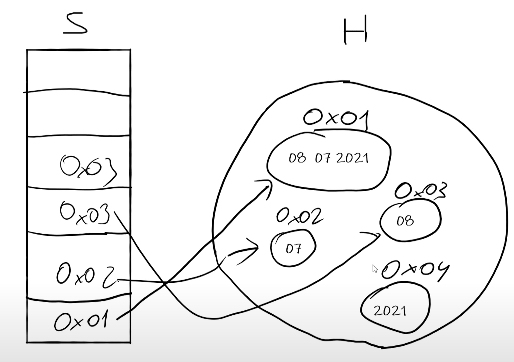

# ref struct am Beispiel ``ReadOnlySpan``

Seit C# 10 und .Net 6.0 wurden ``ref sruct``'s eingeführt.

## Was ist das

Ref Structs sind "Referenztypen", die am Stack gehalten werden. Also kein Teil dieses Datentypes hat eine Verbindung zum Heap.

Was ist hier nun der Vorteil? Die Antwort darauf ist wie bereits so oft schon: Die Cloud! Moderne Softwareentwickung bedeutet: Programmieren für die Cloud. Damit verbunden ist: Resourcensparende-, Speichersparehnde-, Prozessorzeit sparende-, und Anfragesparende Software zu entwickeln, da all diese Dinge Geld kosten. Programiert man sparsam, programmiere man kostengüstig.

## Einfaches Beispiel mit `String`

Wie bereits aus Java bekannt ist die ``String``-Klasse als immutable-Pattern implementiert. Die Instanz kann also zur Laufzeit nicht mehr mit einem neuen Wert versorgt werden. Um hier Performace zu optimieren, ist das sog. ``String``-Pooling im Hintergrund aktiv. Es geht aber noch besser:

Betrachten wir einen einfachen String, den wir mittels Substring in einzelne Teile zerlegen wollen:

```C#
private readonly string _dateString = "08 07 2021";
```

``` C#
    public (int day, int month, int year) SplitDateAsString()
    {
        string dayText = _dateString.Substring(0, 2);
        string monthText = _dateString.Substring(3, 2);
        string yearText = _dateString.Substring(6, 4);
        var day = int.Parse(dayText);
        var month = int.Parse(monthText);
        var year = int.Parse(yearText);

        return (day, month, year);
    }
```

Was passiert im Speicher:

Weil der String immutable ist, muss für jedes Teilstück Speicher am Heap reserviert werden. Die wiederum müssen duch den Grabage Collector bereinigt werden. Jedes Teilstück benötigt/bekommt also einen Speicherplatz im Heap, auf dem vom Stack aus refernziert wird.



Das lässt sich optimieren...

## Verbesserung mit `Span`

Erstellen wir nun aus dem String einen `ReadOnlySpan`...

```C#
public (int day, int month, int year) SplitDateAsSpan()
{
    ReadOnlySpan<char> dateSpan = _dateString;

    var dayText = dateSpan.Slice(0, 2);
    var monthText = dateSpan.Slice(3, 2);
    var yearText = dateSpan.Slice(6, 4);
    var day = int.Parse(dayText);
    var month = int.Parse(monthText);
    var year = int.Parse(yearText);

    return (day, month, year);
}
```

...sieht es im Speicher ganz anders aus:


Lediglich der initiale Date-String ist am Heap vorhanden. Alle Teilungen finden ausschließlich am Stack statt, und werden nicht als einzelne String-Instanzen gesapeichert. Der Garbage-Collector hat also hier deutlich weniger zu tun, was sich in der besseren Laufzeit wiederspiegelt. Der "Tag-Teil [08]" ist nun als Offset (Versetzung) im Stack abgebildet.

## Messung (benötigt Vorwissen!)

Überprüfen wir den Unterschied nun mit einem Benchmarker (Maßstab). Dazu müssen wir folgendes NuGet-Package installieren.

```Powershell
Install Package BenchmarkDotNet
```

Die beiden oben beschriebenen Methoden werden nun mit fogender Dataanotaion versehen:

```C#
[Benchmark]
```

Die beiden Methoden befinden sich in einer Klasse namens ``Benchy``. Diese wird mit dieser Dataannotation versehen:

```C#
[MemoryDiagnoser]
```

Der Benchmarker ist nun konfiguriert und das Programm kann ausgeführt werden. Es wird nun Laufzeit und Speicherbedarf beider Methoden gemessen.

Die Ausgabe produztiert nun jeden menge Information. Gerne könnt ihr die Messwerte studieren. Wichtig ist aber folgender Block, ziemlich am Ende:

```powershell
...
|            Method |     Mean |    Error |   StdDev |  Gen 0 | Allocated |
|------------------ |---------:|---------:|---------:|-------:|----------:|
| SplitDateAsString | 45.31 ns | 0.359 ns | 0.336 ns | 0.0076 |      96 B |
|   SplitDateAsSpan | 25.51 ns | 0.226 ns | 0.212 ns |      - |         - |
...
  
```

Abgesehen davon, dass die Laufzeit in der 2. Methode (untere Zeile) deutlich besser ist (knapp die hälfte) kann man an der 2. Zeile (ReadOnlySpan) auch erkennen kann, dass der allokierte Speicherbedarf am Heap gleich 0 ist, da ja auschließlich im Stack gearbeitet wird. Der ursprüngliche String ist natürlich ein Referenztyp und am Heap vorhanden. Diese Tatsache ist in dieser Tabelle nicht ersichtlich, da ja nur die beiden Methoden gemessen und verglichen wurden.

## Fazit

Dieses Konstrukt kann Laufzeit und Speicher sparen. Nicht jede Klasse sollte sofort als ``ref struct`` ausgeführt werden, da diese auch die bereits bekannten Eigenschaften von ``struct``'s aufweisen (keine Vererbung, ...). Aber als datenhaltende Klassen, die im Immutable-Pattern impelementiert sind und eine vielzahl an Instanzen bedingen, kann man die ``ref struct`` als Variante hernazuiehen.

## Zusatz

Es fällt auf, dass der ``ReadOnlySpan`` als ``readonly`` ausgeführt ist. Wir werden im Kapitel *Collections* erneut darauf stoßen und im Detail besprechen (`IReadOnlyList`).