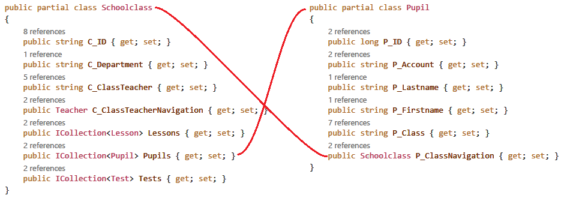

<!-- markdownlint-disable MD045 -->
# Objektgraphen und Gruppierungen

## Datenbankmodell vs. Objektmodell
Bereits zu Beginn der objektorientierten Programmierung wird jeder mit der Beziehung zwischen 2 
Klassen konfrontiert. Es handelt sich meist um eine *Assotiation* und gibt an, dass eine Klasse
eine Andere als Member verwendet.

In Datenbanken gibt es auch Beziehungen zwischen Tabellen. Hier ist es ein Primärschlüssel, der
in anderen Tabellen als Fremdschlüssel verwendet wird, um auf einen Datensatz zu verweisen.

### Abbilden von Beziehungen: Navigations
Diese Ideen sind oberflächlich betrachtet nicht unähnlich. Gerade die Beziehungen in einer relationalen
Datenbank können leicht in der objektorientierten Programmierung nachgebildet werden. Folgendes
Beispiel zeigt eine klassische 1:n Beziehung zwischen zwei Tabellen und eine Assotiation zwischen
2 Klassen.


Die Klassen *Schoolclass* und *Pupil* haben nur datenhaltende Properties und werden als *POCO Klassen* 
(Plain old CLR objects) bezeichnet. Analog gibt es in der Java Welt auch den Begriff *POJO*.

Beide Klassen haben ein *Navigation Property*. In der Klasse *Schoolclass* gibt es eine Collection von
Schülern mit dem Namen *Pupils* (da eine Klasse n Schüler haben kann). Umgekehrt gibt es in der Klasse
*Pupil* einen Verweis auf die Klasse mit dem Namen *P_ClassNavigation*. Da dies die andere Seite der
Beziehung ist, ist das natürlich ein einzelnes Feld und keine Liste.




### Generierung der Modelklassen: Der OR Mapper
Da die Abbildung eines Datenbankmodells in Klassen mechanische Tipparbeit ist, gibt es fertige
Bibliotheken, die diese Klassen anhand einer gegebenen Datenbank generieren: Object-relational Mapper
oder OR Mapper erlauben einen objektorientierten Zugriff auf eine Datenbank. In .NET heißt
der verwendete OR Mapper *Entity Framework*.

## Modell der Tests Datenbank
Die folgenden Beispiele basieren auf einer kleinen Datenbank, in der Lehrer ihre Tests, die sie in
den Klassen haben, erfassen können. Die Schüler können dann darauf zugreifen. Das Modell sieht so
aus:


Aus diesem Datenbankdiagramm wurde folgender Objektgraph erzeugt, der mittels Navigation Properties
verbunden ist:


## Gruppierung in SQL

In SQL gibt es mit der *GROUP BY* Klausel die Möglichkeit, die Daten in Gruppen zu unterteilen.
Betrachten wir unsere Tabelle *Lesson*. Wir können nach verschiedenen Kriterien gruppieren:


Der Zweck von Gruppierungen ist meist das Aggregieren von Daten. In SQL stehen uns die
Aggregatfunktionen *COUNT()*, *MAX()*, *MIN()*, ... zur Verfügung. Diese werden dann pro Gruppe von der
Datenbank ausgewertet:


> **Hinweis:** Natürlich kann nach einer Gruppierung nicht mehr auf die einzelnen Werte zugegriffen
> werden, die nicht Teil der Gruppierung sind. Viele versuchen verzweifelt, bei einer Gruppierung
> nach der Klasse noch den Gegenstand auszugeben. Das kann natürlich nicht funktionieren, da alle
> Datensätze der Klasse bereits zu einem Wert zusammengefasst wurden. Werte, nach denen nicht gruppiert
> wird, müssen immer in einer Aggregatsfunktion stehen.

## Gruppierung in LINQ

Nach diesem Ausflug in SQL sehen wir uns die Implementierung in LINQ an.

### Technische Umsetzung mit IGrouping

Im Namespace *System.Linq* ist ein Interface *IGrouping* definiert, welches folgende Eigenschaften
hat:

```c#
public interface IGrouping<out TKey, out TElement> : IEnumerable<TElement>, IEnumerable
{
    TKey Key { get; }
}
```

Dieses Interface erweitert offensichtlich eine normale Collection (*IEnumerable*) um ein Property *Key*.
In diesem Property ist der Wert, nach dem gruppiert wird gespeichert. Ein konkretes Beispiel erklärt
den Einsatz am Besten:

```c#
data.Lesson
    .GroupBy(l => l.L_Class)
    .Select(g => new
    {
        Class   = g.Key,
        Count   = g.Count(),
        MaxHour = g.Max(x => x.L_Hour)
    });
```

Verwirrend ist hier der Einsatz der Gruppierungsvariable *g*. Sie ist eine Instanz von *IGrouping* und
somit kann über das Property *Key* auf den Gruppierungsschlüssel zugegriffen werden. Möchte man auf
die Werte in der Gruppe zugreifen, wird einfach *g* verwendet. Dadurch funktioniert der Ausdruck
*g.Max(x => x.L_Hour)* und liefert die letzte Stunde pro Klasse.


Natürlich kann auch hier nicht auf einzelne Werte zugegriffen werden. Da *g* eine Collection ist,
funktioniert der Zugriff auf *g.L_Teacher* so wie auf *data.Lessons.L_Teacher* syntaktisch nicht
(eine Collection hat kein Property *L_Teacher*).

Möchte man nach mehreren Spalten gruppieren, wird mit *new* ein neuer Typ erzeugt:

```c#
data.Lesson
    .GroupBy(l => new { l.L_Class, l.L_Subject })
    .Select(g => new
		{
			Class   = g.Key.L_Class,
			Subject = g.Key.L_Subject,
			Count   = g.Count(),
			MaxHour = g.Max(x => x.L_Hour)
		});
```

Manchmal möchte man eine DISTINCT Abfrage erstellen, die nur einen Wert pro Gruppierung liefert.
Das folgende Beispiel liefert nur einen Lehrer pro eingetragener Email Adresse:

```c#
IEnumerable<Teacher> teachersUniqueMail = data.Teacher
    .GroupBy(t => t.T_Email)
    .Select(g => g.First());
```

## Übungen

Löse die Aufgaben in der Datei [Program.cs](Program.cs) und schreibe deine Abfragen statt `(object)null;`
in die Variablen. Die korrekten Ausgaben sind unter dem Klassendiagramm aufgelistet.


```text
RESULT1
[{"TeacherId":"AF","Subjects":["RISL"]},{"TeacherId":"AGU","Subjects":["AP4","WPT_4"]},{"TeacherId":"AH","Subjects":["NVS1","OPS"]},{"TeacherId":"AMA","Subjects":["AP4","ITPR","NVS1","NVS1x","NVS1y","NWT_1x","NWT_1y","NWT_4A","NWT1"]},{"TeacherId":"AT","Subjects":["D","Dx","RE"]},{"TeacherId":"BAE","Subjects":["EWD","KGKP","MTKG"]},{"TeacherId":"BAM","Subjects":["DBI1","POS1"]},{"TeacherId":"BAN","Subjects":["DBI1","DBI1y","DBI2x"]},{"TeacherId":"BAR","Subjects":["BMG2","FMGTK","SOPK"]},{"TeacherId":"BEC","Subjects":["MGAN","MPAN","SOPK"]}]

RESULT2
[{"DisplayMonth":"2020-04","Tests":[{"Date":"2020-04-01T00:00:00","Teacher":"PC","Subject":"AMx"},{"Date":"2020-04-01T00:00:00","Teacher":"PC","Subject":"AMy"},{"Date":"2020-04-07T00:00:00","Teacher":"SH","Subject":"PRE"},{"Date":"2020-04-08T00:00:00","Teacher":"SO","Subject":"E1y"},{"Date":"2020-04-24T00:00:00","Teacher":"NAI","Subject":"Dy"},{"Date":"2020-04-30T00:00:00","Teacher":"AH","Subject":"OPS"}]},{"DisplayMonth":"2020-07","Tests":[{"Date":"2020-07-02T00:00:00","Teacher":"BH","Subject":"NVS1"}]},{"DisplayMonth":"2020-05","Tests":[{"Date":"2020-05-26T00:00:00","Teacher":"BH","Subject":"OPS"}]},{"DisplayMonth":"2020-01","Tests":[{"Date":"2020-01-01T00:00:00","Teacher":"SO","Subject":"E1x"},{"Date":"2020-01-08T00:00:00","Teacher":"GC","Subject":"BWM1"},{"Date":"2020-01-16T00:00:00","Teacher":"SWH","Subject":"NVS1"}]},{"DisplayMonth":"2019-09","Tests":[{"Date":"2019-09-05T00:00:00","Teacher":"GC","Subject":"BWM2"},{"Date":"2019-09-29T00:00:00","Teacher":"KSR","Subject":"GAD"},{"Date":"2019-09-30T00:00:00","Teacher":"KUE","Subject":"PRE"}]},{"DisplayMonth":"2020-06","Tests":[{"Date":"2020-06-14T00:00:00","Teacher":"GC","Subject":"BWM3"},{"Date":"2020-06-24T00:00:00","Teacher":"HAF","Subject":"BAP"}]},{"DisplayMonth":"2019-11","Tests":[{"Date":"2019-11-03T00:00:00","Teacher":"PUA","Subject":"IOT"},{"Date":"2019-11-11T00:00:00","Teacher":"GRJ","Subject":"BAP"},{"Date":"2019-11-24T00:00:00","Teacher":"NAI","Subject":"Dx"}]},{"DisplayMonth":"2020-02","Tests":[{"Date":"2020-02-15T00:00:00","Teacher":"GRJ","Subject":"POS1"},{"Date":"2020-02-15T00:00:00","Teacher":"HIK","Subject":"DBI1"},{"Date":"2020-02-22T00:00:00","Teacher":"SZ","Subject":"POS1"}]},{"DisplayMonth":"2019-12","Tests":[{"Date":"2019-12-04T00:00:00","Teacher":"SK","Subject":"GAD"},{"Date":"2019-12-13T00:00:00","Teacher":"HW","Subject":"IOT"},{"Date":"2019-12-21T00:00:00","Teacher":"TT","Subject":"PRE"},{"Date":"2019-12-26T00:00:00","Teacher":"RA","Subject":"DBI1"}]}]

RESULT3
[{"P_ID":3175,"P_Firstname":"Batuhan","P_Lastname":"Akcay","Tests":[{"Subject":"OPS","Termine":[{"TE_Teacher":"AH","TE_Date":"2020-04-30T00:00:00","TE_Lesson":1},{"TE_Teacher":"BH","TE_Date":"2020-05-26T00:00:00","TE_Lesson":9}]},{"Subject":"NVS1","Termine":[{"TE_Teacher":"BH","TE_Date":"2020-07-02T00:00:00","TE_Lesson":1},{"TE_Teacher":"SWH","TE_Date":"2020-01-16T00:00:00","TE_Lesson":3}]},{"Subject":"BWM1","Termine":[{"TE_Teacher":"GC","TE_Date":"2020-01-08T00:00:00","TE_Lesson":3}]},{"Subject":"BWM2","Termine":[{"TE_Teacher":"GC","TE_Date":"2019-09-05T00:00:00","TE_Lesson":2}]},{"Subject":"BWM3","Termine":[{"TE_Teacher":"GC","TE_Date":"2020-06-14T00:00:00","TE_Lesson":2}]},{"Subject":"BAP","Termine":[{"TE_Teacher":"GRJ","TE_Date":"2019-11-11T00:00:00","TE_Lesson":7},{"TE_Teacher":"HAF","TE_Date":"2020-06-24T00:00:00","TE_Lesson":2}]},{"Subject":"POS1","Termine":[{"TE_Teacher":"GRJ","TE_Date":"2020-02-15T00:00:00","TE_Lesson":7},{"TE_Teacher":"SZ","TE_Date":"2020-02-22T00:00:00","TE_Lesson":10}]},{"Subject":"DBI1","Termine":[{"TE_Teacher":"HIK","TE_Date":"2020-02-15T00:00:00","TE_Lesson":4},{"TE_Teacher":"RA","TE_Date":"2019-12-26T00:00:00","TE_Lesson":5}]},{"Subject":"IOT","Termine":[{"TE_Teacher":"HW","TE_Date":"2019-12-13T00:00:00","TE_Lesson":7},{"TE_Teacher":"PUA","TE_Date":"2019-11-03T00:00:00","TE_Lesson":10}]},{"Subject":"GAD","Termine":[{"TE_Teacher":"KSR","TE_Date":"2019-09-29T00:00:00","TE_Lesson":5},{"TE_Teacher":"SK","TE_Date":"2019-12-04T00:00:00","TE_Lesson":6}]},{"Subject":"PRE","Termine":[{"TE_Teacher":"KUE","TE_Date":"2019-09-30T00:00:00","TE_Lesson":8},{"TE_Teacher":"SH","TE_Date":"2020-04-07T00:00:00","TE_Lesson":3},{"TE_Teacher":"TT","TE_Date":"2019-12-21T00:00:00","TE_Lesson":3}]},{"Subject":"Dx","Termine":[{"TE_Teacher":"NAI","TE_Date":"2019-11-24T00:00:00","TE_Lesson":1}]},{"Subject":"Dy","Termine":[{"TE_Teacher":"NAI","TE_Date":"2020-04-24T00:00:00","TE_Lesson":3}]},{"Subject":"AMx","Termine":[{"TE_Teacher":"PC","TE_Date":"2020-04-01T00:00:00","TE_Lesson":9}]},{"Subject":"AMy","Termine":[{"TE_Teacher":"PC","TE_Date":"2020-04-01T00:00:00","TE_Lesson":9}]},{"Subject":"E1x","Termine":[{"TE_Teacher":"SO","TE_Date":"2020-01-01T00:00:00","TE_Lesson":3}]},{"Subject":"E1y","Termine":[{"TE_Teacher":"SO","TE_Date":"2020-04-08T00:00:00","TE_Lesson":4}]}]},{"P_ID":3176,"P_Firstname":"Teryilla","P_Lastname":"Amaichigh","Tests":[{"Subject":"OPS","Termine":[{"TE_Teacher":"AH","TE_Date":"2020-04-30T00:00:00","TE_Lesson":1},{"TE_Teacher":"BH","TE_Date":"2020-05-26T00:00:00","TE_Lesson":9}]},{"Subject":"NVS1","Termine":[{"TE_Teacher":"BH","TE_Date":"2020-07-02T00:00:00","TE_Lesson":1},{"TE_Teacher":"SWH","TE_Date":"2020-01-16T00:00:00","TE_Lesson":3}]},{"Subject":"BWM1","Termine":[{"TE_Teacher":"GC","TE_Date":"2020-01-08T00:00:00","TE_Lesson":3}]},{"Subject":"BWM2","Termine":[{"TE_Teacher":"GC","TE_Date":"2019-09-05T00:00:00","TE_Lesson":2}]},{"Subject":"BWM3","Termine":[{"TE_Teacher":"GC","TE_Date":"2020-06-14T00:00:00","TE_Lesson":2}]},{"Subject":"BAP","Termine":[{"TE_Teacher":"GRJ","TE_Date":"2019-11-11T00:00:00","TE_Lesson":7},{"TE_Teacher":"HAF","TE_Date":"2020-06-24T00:00:00","TE_Lesson":2}]},{"Subject":"POS1","Termine":[{"TE_Teacher":"GRJ","TE_Date":"2020-02-15T00:00:00","TE_Lesson":7},{"TE_Teacher":"SZ","TE_Date":"2020-02-22T00:00:00","TE_Lesson":10}]},{"Subject":"DBI1","Termine":[{"TE_Teacher":"HIK","TE_Date":"2020-02-15T00:00:00","TE_Lesson":4},{"TE_Teacher":"RA","TE_Date":"2019-12-26T00:00:00","TE_Lesson":5}]},{"Subject":"IOT","Termine":[{"TE_Teacher":"HW","TE_Date":"2019-12-13T00:00:00","TE_Lesson":7},{"TE_Teacher":"PUA","TE_Date":"2019-11-03T00:00:00","TE_Lesson":10}]},{"Subject":"GAD","Termine":[{"TE_Teacher":"KSR","TE_Date":"2019-09-29T00:00:00","TE_Lesson":5},{"TE_Teacher":"SK","TE_Date":"2019-12-04T00:00:00","TE_Lesson":6}]},{"Subject":"PRE","Termine":[{"TE_Teacher":"KUE","TE_Date":"2019-09-30T00:00:00","TE_Lesson":8},{"TE_Teacher":"SH","TE_Date":"2020-04-07T00:00:00","TE_Lesson":3},{"TE_Teacher":"TT","TE_Date":"2019-12-21T00:00:00","TE_Lesson":3}]},{"Subject":"Dx","Termine":[{"TE_Teacher":"NAI","TE_Date":"2019-11-24T00:00:00","TE_Lesson":1}]},{"Subject":"Dy","Termine":[{"TE_Teacher":"NAI","TE_Date":"2020-04-24T00:00:00","TE_Lesson":3}]},{"Subject":"AMx","Termine":[{"TE_Teacher":"PC","TE_Date":"2020-04-01T00:00:00","TE_Lesson":9}]},{"Subject":"AMy","Termine":[{"TE_Teacher":"PC","TE_Date":"2020-04-01T00:00:00","TE_Lesson":9}]},{"Subject":"E1x","Termine":[{"TE_Teacher":"SO","TE_Date":"2020-01-01T00:00:00","TE_Lesson":3}]},{"Subject":"E1y","Termine":[{"TE_Teacher":"SO","TE_Date":"2020-04-08T00:00:00","TE_Lesson":4}]}]}]

RESULT4
[{"Day":4,"Hour":3,"ClassCount":69},{"Day":2,"Hour":4,"ClassCount":68},{"Day":3,"Hour":3,"ClassCount":67},{"Day":4,"Hour":2,"ClassCount":67},{"Day":3,"Hour":4,"ClassCount":67}]

RESULT5
[{"Department":"FIT","Count":7},
{"Department":"HBG","Count":9},
{"Department":"HIF","Count":23},
{"Department":"HKU","Count":5},
{"Department":"HMN","Count":10},
{"Department":"HWI","Count":11},
{"Department":"O","Count":1},
{"Department":"VIF","Count":5},
{"Department":"AIF","Count":12},
{"Department":"BIF","Count":9},
{"Department":"CIF","Count":6},
{"Department":"CMN","Count":6},
{"Department":"KIF","Count":6},
{"Department":"KKU","Count":4},
{"Department":"BKU","Count":2}]

RESULT6
[{"Department":"HIF","Count":23},
{"Department":"HWI","Count":11},
{"Department":"AIF","Count":12}]

RESULT7
[{"Teacher":"AH","Subject":"OPS","LastTest":"2020-04-30T00:00:00"},
{"Teacher":"BH","Subject":"NVS1","LastTest":"2020-07-02T00:00:00"},
{"Teacher":"BH","Subject":"OPS","LastTest":"2020-05-26T00:00:00"},
{"Teacher":"GC","Subject":"BWM1","LastTest":"2020-01-08T00:00:00"},
{"Teacher":"GC","Subject":"BWM2","LastTest":"2019-09-05T00:00:00"},
{"Teacher":"GC","Subject":"BWM3","LastTest":"2020-06-14T00:00:00"},
{"Teacher":"GRJ","Subject":"BAP","LastTest":"2019-11-11T00:00:00"},
{"Teacher":"GRJ","Subject":"POS1","LastTest":"2020-02-15T00:00:00"},
{"Teacher":"HAF","Subject":"BAP","LastTest":"2020-06-24T00:00:00"},
{"Teacher":"HIK","Subject":"DBI1","LastTest":"2020-02-15T00:00:00"},
{"Teacher":"HW","Subject":"IOT","LastTest":"2019-12-13T00:00:00"},
{"Teacher":"KSR","Subject":"GAD","LastTest":"2019-09-29T00:00:00"},
{"Teacher":"KUE","Subject":"PRE","LastTest":"2019-09-30T00:00:00"},
{"Teacher":"NAI","Subject":"Dx","LastTest":"2019-11-24T00:00:00"},
{"Teacher":"NAI","Subject":"Dy","LastTest":"2020-04-24T00:00:00"},
{"Teacher":"PC","Subject":"AMx","LastTest":"2020-04-01T00:00:00"},
{"Teacher":"PC","Subject":"AMy","LastTest":"2020-04-01T00:00:00"},
{"Teacher":"PUA","Subject":"IOT","LastTest":"2019-11-03T00:00:00"},
{"Teacher":"RA","Subject":"DBI1","LastTest":"2019-12-26T00:00:00"},
{"Teacher":"SH","Subject":"PRE","LastTest":"2020-04-07T00:00:00"},
{"Teacher":"SK","Subject":"GAD","LastTest":"2019-12-04T00:00:00"},
{"Teacher":"SO","Subject":"E1x","LastTest":"2020-01-01T00:00:00"},
{"Teacher":"SO","Subject":"E1y","LastTest":"2020-04-08T00:00:00"},
{"Teacher":"SWH","Subject":"NVS1","LastTest":"2020-01-16T00:00:00"},
{"Teacher":"SZ","Subject":"POS1","LastTest":"2020-02-22T00:00:00"},
{"Teacher":"TT","Subject":"PRE","LastTest":"2019-12-21T00:00:00"}]
```
