# ASP.net Core MVC

Auf MSDN ist sehr bviel Material über ASP.Net Core verfügbar:

<https://docs.microsoft.com/de-at/aspnet/core/tutorials/first-mvc-app/start-mvc?view=aspnetcore-3.1&tabs=visual-studio>

## Projekt anlegen

Das Anlegeh eines neuen Projektes nochmal zusammengefasst:

Blank Solution anlegen. Darin werden dann alle weiteren Projekte angelegt.

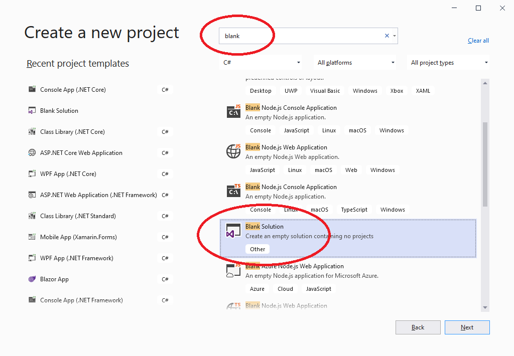

Verzeichnis wählen, Nme vergeben. Die Konventiobn sieht vor: ``[Unternehmen].[Solutionname]``

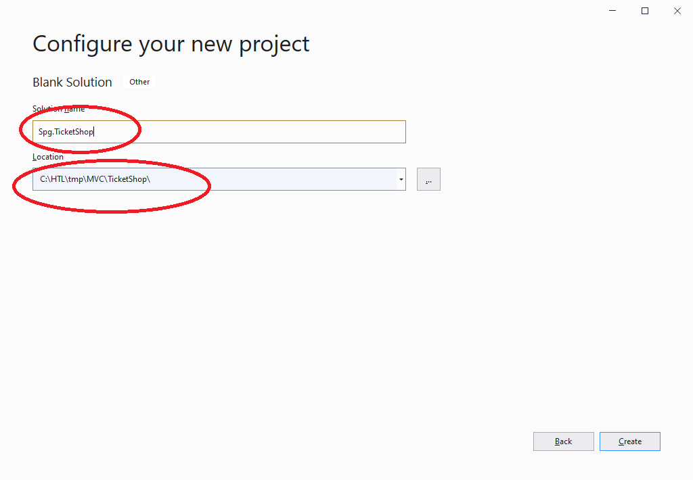

Das Proekt hinzufügen. (ASP.NET Core Web-Application)

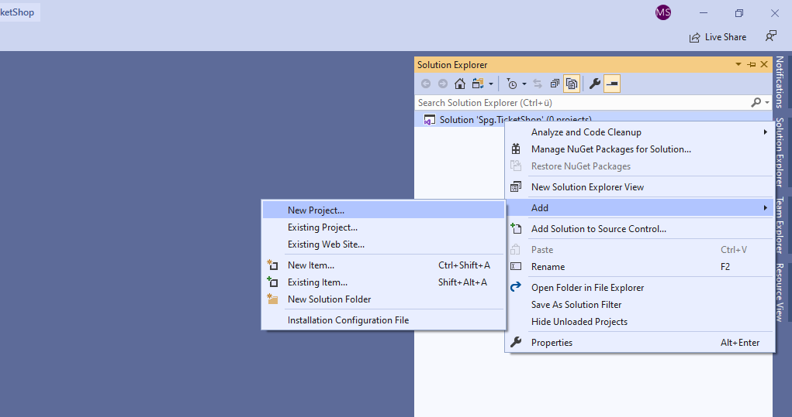

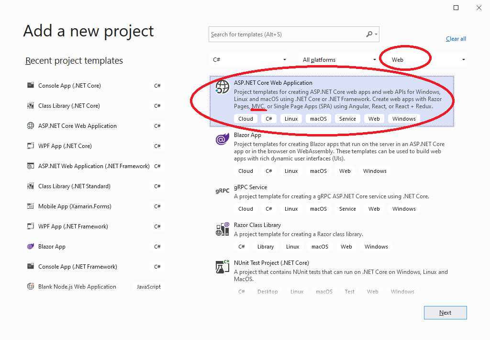

Die Konvention gibt vor, dass das Projekt in der Solution im Unterverzeichnis ``src`` angelegt wird.

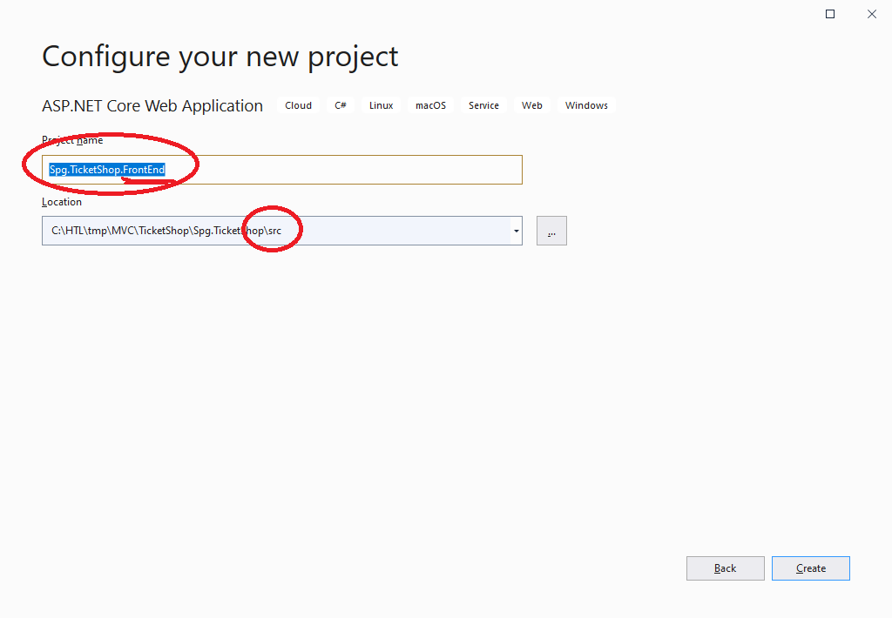

MVC wählen

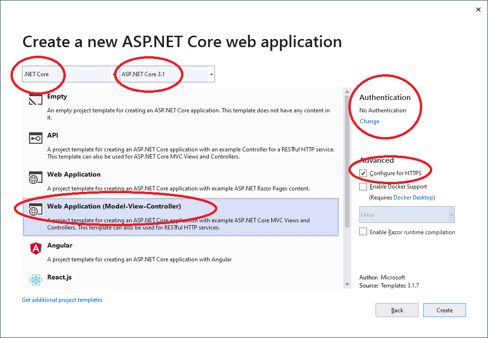

Das ist das Ergebnis im Solution Explorer

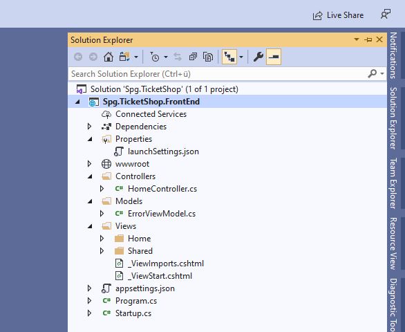

Wir legen ein weiters Projekt in der Solution an (Classs-Library(.NET Core))

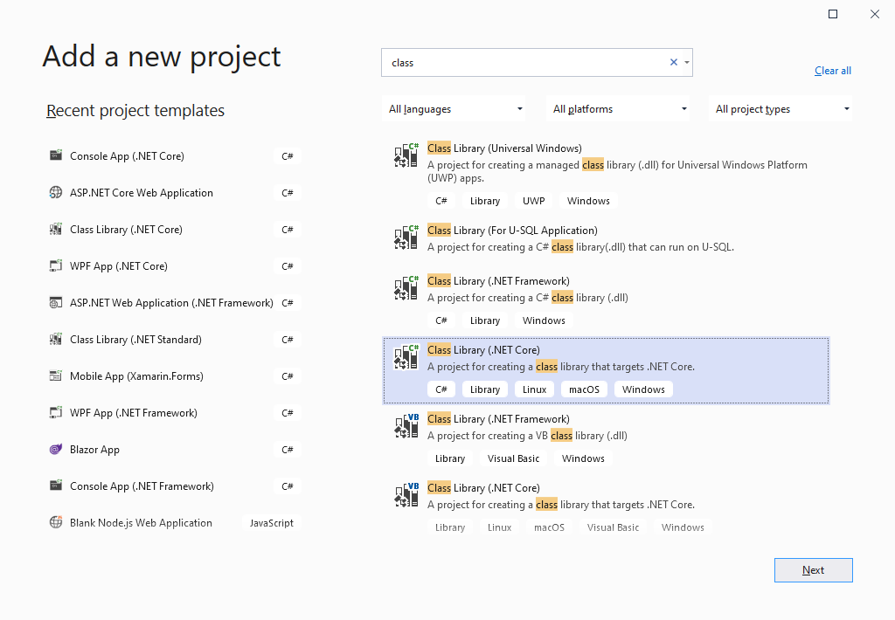

## Projektstruktur

Das ist das Ergebnis im Solution Explorer. Es ist notwendig eine Dependency auf das Services-projekt zu legen. (Dependencies, rechte Maustaste, ``Add Project Reference...)``

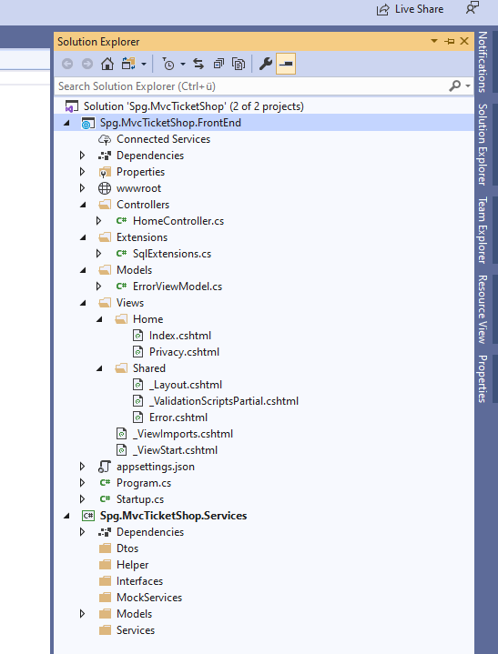

## Controller hinzufügen

Controller werden folgendermaßen hinzugefügt.

Achtung! Darauf achten, dass man sich im Controllers-Ordner befindet.


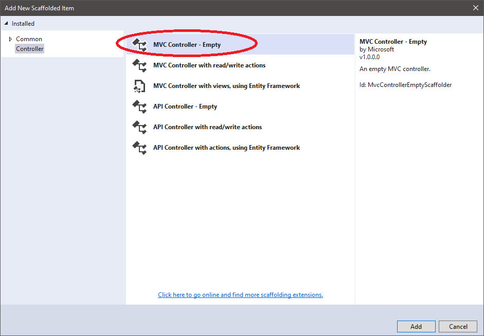

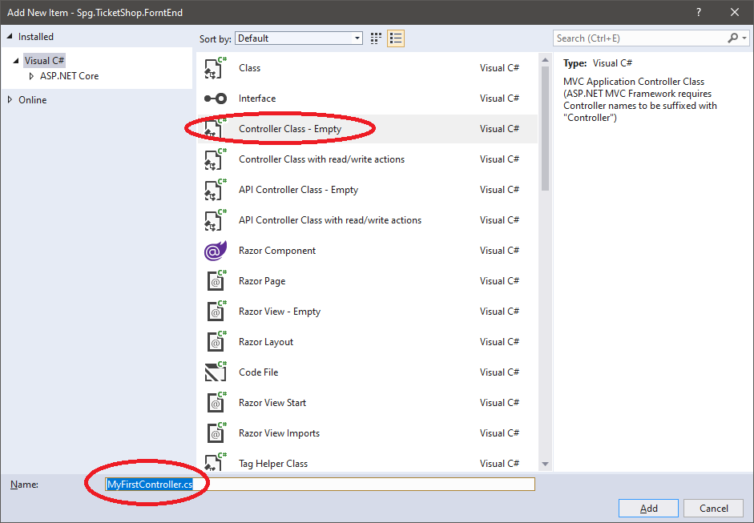

Der Controller übernimmt Parameter aus dem Query-String und stellt der View die daten in Form eines Models bereit.

## View hinzufügen

Das gleich gilt für die Views:


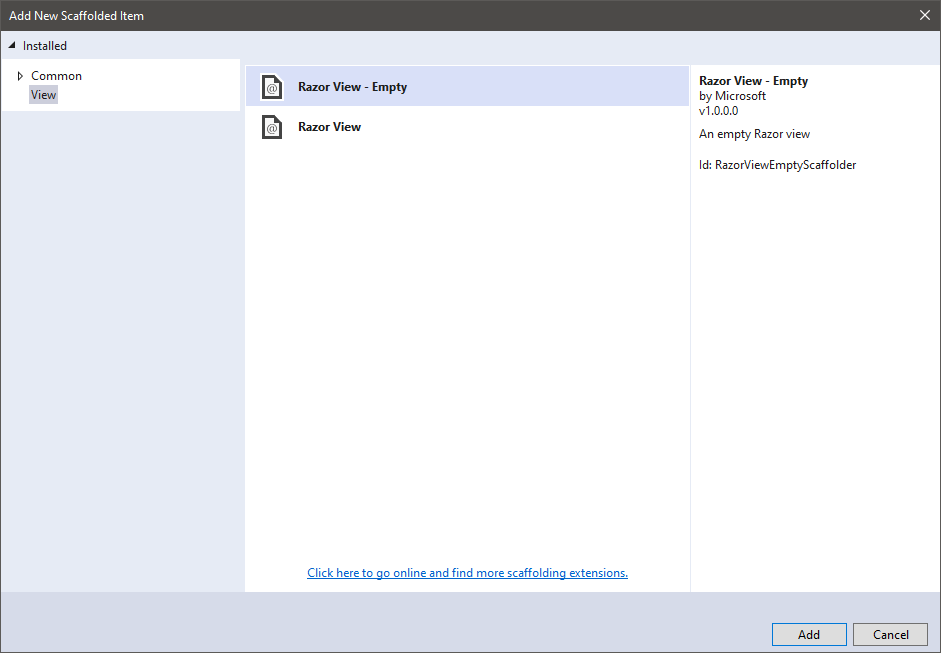

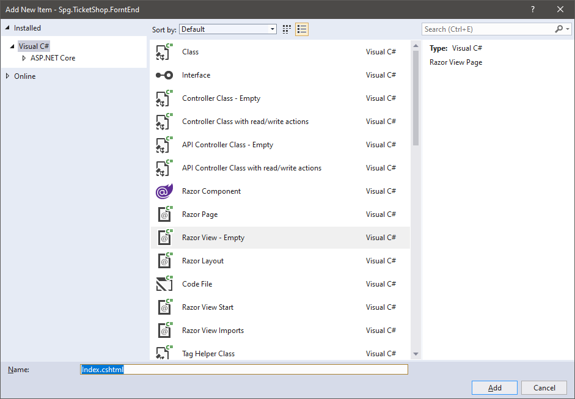

Die View zeigt die Daten aus dem Model an.

## Arbeiten mit Models

Das MVC-Pattern:

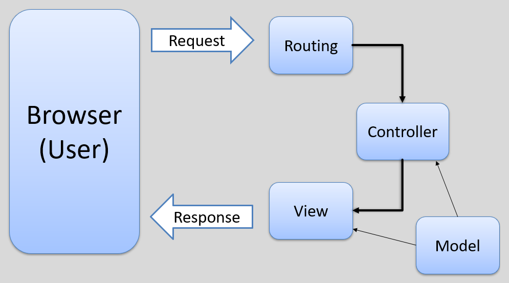

Fügen wir im Verzeichnis ``Models`` ein einfaches Model hinzu:

```C#
public class Guest
{
    public string FirstName { get; set; }

    public string LastName { get; set; }

    public string EMail { get; set; }
}
```

Die Verwendung im Controller wäre dann beispielsweise:

```C#
[HttpGet()]
public IActionResult Guest()
{
    Guest guest = new Guest() { FirstName = "Martin", LastName = "Schrutek", EMail = "schrutek@spengergasse.at" };

    return View(guest);
}
```

## Data Annotations

Mit Attributen (Data Annotations) können im Model Datentypen, Überprüfungen, Begrenzungen, ... festgelegt werden.

```C#
[Required]
[StringLength(250)]
public string Name { get; set; }
```

## Model State

Create Methode:
Eine Create View ohne DB zeigen, nur ModelState.IsValid. Wenn OK, redirect to Index, sonst return View(model);
if (ModelState.IsValid)

## Übung

* Erstelle eine neue Solution mit dem Namen `Spg.PupilAdministration`.
* Erstelle darin ein MVC Projekt im Unterverzeichnis `src` mit dem Namen `Spg.PupilAdministration.WebApp`.
* Erstelle einen Controller um eine Seite  mit Pupils anzuzeigen. Erstelle auch eine dafür notwendige View im richtigen Veerzeichnis in der Solution.
* Erstelle eine Klasse `Pupil` im Namespace `Models` und eine Klasse `Schoolclass`.
* `Pupil` soll folgende Properties enthalten: Id, Firstname, Lastname, Class, Gender (alles Strings)
* `Schoolclass` soll folgende Properties enthalten: Name, Abteilung (alles Strings)
* Erstelle noch eine Klasse `SchuelerDb` in diesem Namespace und kopiere den Inhalt vom File oben dort hinein.
* Erweitere die View um die Angabe eines Models und um eine Ausgabe der Pupils. Form und formatierung der Ausgabe ist dabei frei wählbar.
* Erweitere den Controller so, dass die Pupil-Daten aus der SchuelerDb geladen werden und ein Model an die View ausgegeben wird.

### Ergebis

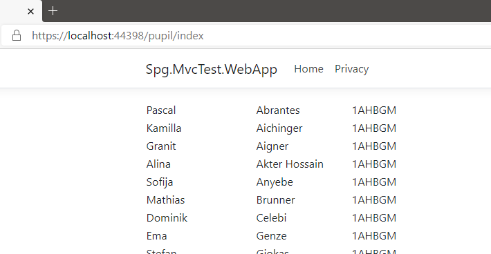
