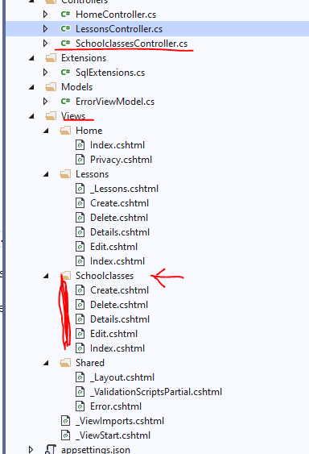

# ASP.net Core MVC (DB-Zugriffe)

Wir wollen mit der Applikation natürlich Daten aus einer DB lesen und darstellen, bzw. diese manipulieren, also CRUD-Operations. Wie ja bekannt sind das die gängigsten Anwendungsfälle bei Datenbankapplikationen.

## Model erstellen

Das Domain Object Model erstellen wir, wie gewohnt mittels Database First-Ansatz, über das Scuffold Commando im Package Manager:

```Powersehll
Scaffold-DbContext "Data Source=WE20W8WS2000501\SQLEXPRESS;Initial Catalog=TicketShop;Integrated Security=True;" Microsoft.EntityFrameworkCore.SqlServer -OutputDir Models -UseDatabaseNames -Force -DataAnnotations
```

Alternativ kann natürlich auch ein Code-First Ansatz verwendet werden.

Wichtig! Den Connection-String aus dem Context-File entfernen:

<https://github.com/schrutek/SPG_POS/tree/master/CSharp/EF%20Core/ConnectionString.md>

Logging für EF-Core aktivieren:

<https://github.com/schrutek/SPG_POS/tree/master/CSharp/EF%20Core/EFLogger.md>

## Scuffolding des Models

Wir Scuffolden nun ein Model um daraus die Views und den Controller erstellen zu können.

Dazu:
Im Contextmenü: Add, New Scuffolded Item... ; MVC Controller with Views using EF, DB Context angeben, usw.


Wir erhalten jede Menge autogenerirten Code. Im Prinzip ist es aber recht einfach zu verstehen.

Es wird eine Controller-Klasse erstellt und in einem eigenen Unterverzeichnis die dazugehörigen Views (Model-View-Controller)



### Beispiele für Routen

* GET api/books – Lists all the books.
* GET api/books/details/{id} – Gets the details of a book.
* GET api/books/create – Shows the initial create book page.
* POST api/books/create – Creates a new book.
* GET api/books/edit/{id} – Shows the initial edit page.
* POST api/books/edit/{id} – Updates the details of a book.
* GET api/books/delete/{id} – Shows the delete confirmation page.
* POST api/books/delete/{id} – Deletes a book.

## Die erste Liste

Im Prinzip funktioniert der generierte Code bereits und liefert ein schönes Ergebnis. Aber man kann ihn natürlich erweitern:

In diesem beispiel wird eine Meldung ausgegeben, dass keine Ergebnisse gefunden wurden, wenn das Modell (Liste) ``null`` oder leer ist .

```C#
@if (Model != null
    && Model.Count > 0)
{
    <table class="table">
        <thead>
            <tr>
                ...
           </tr>
        </thead>
        <tbody>
            @foreach (var item in Model)
            {
                <tr>
                    ...
                </tr>
            }
        </tbody>
    </table>
}
else
{
    <label>Keine Ergebnisse gefunden!</label>
}
```

### Tag-Helper

Details hier: <https://docs.microsoft.com/en-us/aspnet/core/mvc/views/working-with-forms?view=aspnetcore-3.1#the-form-tag-helper>

Tag-Helper werden mit den Prefix `asp-` versehen. Das ist aber lediglich Konvention. Dahinter steht, wie auch bei den alten Tag-Helpern eine C# Klasse, die HTML erzeugt.

`asp-for` extrahiert den Namen des Properties und stellt diesen dar:

```HTML
<label asp-for="@firstEvent.Name"></label>
```

Eine andere Variante (als die autogenerierte) um die Items in der Tabelle darzustellen ist, mittels HTML-Tag `label`:

```HTML
<label>@item.Name</label>
```

 z.B:

 ```HTML
<th>
    <a asp-action="Index" asp-route-sortOrder="@ViewData["NameSortParm"]">
        <label asp-for="@firstEvent.Name"></label>
    </a>
</th>
```

Einen Action-Link erzeugt man z.B. so:

```HTML
 <a asp-action="Edit" asp-route-id="@item.EventId">Edit</a>
 ```

 `asp-route` ist dabei der Route-Parameter, welcher nachher zur  GET-URL hinzugefügt wird: (siehe oben, "Beispiele für Routen")

oder:

 ```HTML
 <a asp-controller="Shows" asp-action="FilteredById" asp-route-eventid="@item.EventId">Shows</a>
 ```

 Der Parameter in der GET-Controllermethode würde hier `eventId` heißen. Man kann belibig viele `asp-route-` angeben. Gut ist es aber nicht (**Security-Issue**). Wenn möglich auf ID's beschränken. Keinesfalls Kontonummern, Kreditkartennummern oder Kennwörter in die URL schreiben!! (Achtung Cross Site Scripting). Sogar Namen sollten (wenn geht) vermieden werden.

## Edit Page

Der generierte Code muss im Normalfall nicht großertig verändert werden, aber die clientseitige validierung wäre erwähnenswert. (JQuery-Validation)

<https://docs.microsoft.com/de-de/aspnet/core/mvc/models/validation?view=aspnetcore-3.1>

```HTML
<form asp-action="Edit">
    <div asp-validation-summary="ModelOnly" class="text-danger"></div>
    <input type="hidden" asp-for="EventId" />
    <div class="form-group">
        <label asp-for="LastChangeDate" class="control-label"></label>
        <input asp-for="LastChangeDate" class="form-control" />
        <span asp-validation-for="LastChangeDate" class="text-danger"></span>
    </div>
    ...
```

## Create Page

Die View gleicht im Prinzip jener der Edit-Page. Die Controller-Methode ist natürlich etwas anders.

## Delete Page

Hie gibt es eine View für die GET-Methode und eine für die POST-Methode. Die Get-Methode zeigt den zu löschenden Datensatz nochmal an (im Prinzip genau so, wie die Details-Page) die POST-Methode löscht den Datensatz dann endgültig. Das ist quasi eine "Wollen Sie diesen Datensatz wirklich löschen"-Frage.
