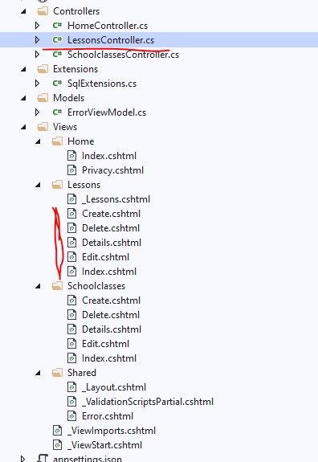
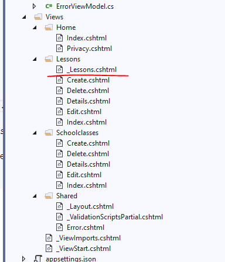

# ASP.net Core MVC (Views, Partial Views)

Wie bereits kennen gelernt, Views und Partial Views enthalten das für die darstellung nötige HTML, CSS und Razor.

## Die wichtigsten Views

### Layout.cshtml

Diese View stellt den "Rahmen" der Webseite dar. Bei jedem Seitenaufruf wird sie geladen. In den Razor-Tag `@RenderBody()` wird der Inhalt  der jeweiligen View platziert.

### Die Views eines Controllers

Die Aufteilung per Konvntion ist so, dass im Verzeichnis `Views` ein Unterverzeichnis mit gleichem Namen wie der Controller existiert. z.B.: `EventsController` => `Events`. DArunter existieren dann die einzelnen Views (Index, Create, Edit, Delete, ...). Die Namen der Views entsprechen der Action-Methode im Conrtrolleer.



## Razor

Kurz gesagt, Razor ist eine Markup-Syntax die in den Views verrndet werden kann. Dwtails dazu auf MS-Docs:

[https://docs.microsoft.com/en-us/aspnet/core/mvc/views/razor?view=aspnetcore-3.1]

### Tag Helper

[https://docs.microsoft.com/en-us/aspnet/core/mvc/views/working-with-forms?view=aspnetcore-3.1#the-form-tag-helper]

Ein Besipiel dazu für Routing:

```C#
<a asp-action="Details" asp-route-id="@item.ShowId" asp-route-eventid="@item.EventId">Details</a>
```

```C#
[HttpGet("{id}")]
public async Task<IActionResult> Details(Guid? id, Guid eventId)
{
    if (!id.HasValue )
    {
        return NotFound();
    }

    var result = await _showService.GetSingleOrDefaultAsync(id.Value);

    if (result == null)
    {
        return NotFound();
    }

    return View(result);
}
```

[https://docs.microsoft.com/en-us/aspnet/core/mvc/views/tag-helpers/built-in/anchor-tag-helper?view=aspnetcore-3.1]

## Partial Views

Anders als Views sind Partial Views üblicherweise dazu da um nicht eine ganze Seite zu endern, sondern einen kleinen Teil einer anderen View wiederzuverwenden.

Beispiel: Ein Event hat mehrere Shows. Es gibt eine View die alle Events anzeigt und eine View, die die Shows eines Events anzeigt. Nun sollen aber die Shows eines Events zusätzlich auf der Detailseite des Events angezeigt werden. Dafür eignet sich eine PartialView, die man für beides einsetzen kann.



Gemäß der Namenskonvention beginnt eine PartialBiew immer mit einem Unterstrich `_partial.cshtml`.

Der Controller muss in einer Action-Methode eine PartialView zurück geben:

```C#
public async Task<IActionResult> FilteredByIdPartial(Guid eventId)
{
    throw new NotImplementedException("Test-Error");
    if (eventId == null)
    {
        return NotFound();
    }

    var model = await _showService.GetAllByEventAsync(eventId);

    if (model == null)
    {
        return NotFound();
    }

    return PartialView("_Shows", model);
}
```

die Partial View: Achtung, diese enthält ein Model!

```HTML
@model IEnumerable<Spg.MvcTicketShop.Services.Models.Shows>

<table class="table">
    <thead>
        <tr>
            <th>
                @Html.DisplayNameFor(model => model.LastChangeDate)
            </th>
            <th>
                @Html.DisplayNameFor(model => model.CheckIn)
            </th>
            <th>
                @Html.DisplayNameFor(model => model.Start)
            </th>
            <th>
                @Html.DisplayNameFor(model => model.End)
            </th>
            <th>
                @Html.DisplayNameFor(model => model.Event)
            </th>
            <th></th>
        </tr>
    </thead>
    <tbody>
        @foreach (var item in Model)
        {
            <tr>
                <td>
                    @Html.DisplayFor(modelItem => item.LastChangeDate)
                </td>
                <td>
                    @Html.DisplayFor(modelItem => item.CheckIn)
                </td>
                <td>
                    @Html.DisplayFor(modelItem => item.Start)
                </td>
                <td>
                    @Html.DisplayFor(modelItem => item.End)
                </td>
                <td>
                    @Html.DisplayFor(modelItem => item.Event.Name)
                </td>
                <td>
                    <a asp-action="Edit" asp-route-id="@item.ShowId">Edit</a> |
                    <a asp-action="Details" asp-route-id="@item.ShowId">Details</a> |
                    <a asp-action="Delete" asp-route-id="@item.ShowId">Delete</a>
                </td>
            </tr>
        }
    </tbody>
</table>
```

Der Aufruf der Partial View erfolgt dann auf der jeweiligen BView (in diesem Beispiel die `Details.cshtml` von `Events`) durch einbetten dieses Codes:

```HTML
<partial name="../Shows/_Shows" model="Model.Shows" />
```
