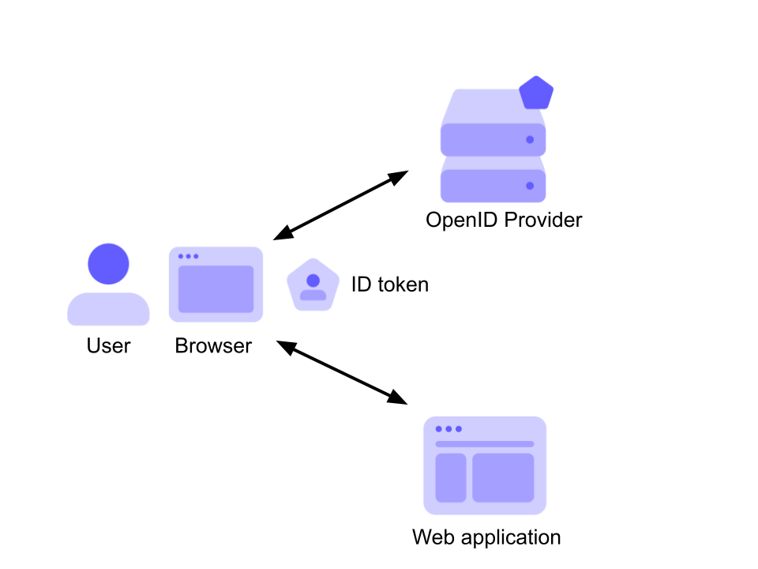

# Token

Beides kann als JWT-Token ausgeführt werden.

Zwischen ID und Access-Token besteht ein wesentlicher Unterschied in der Verwendung

## ID Token

Der ID-Token wird nicht von der Web-app zur API übertragen. Er bestätigt, dass der User für eine bestimmte Applikation angemeldet ist.

Enthält:

* Claims
  - Audience (Für welche App gilt der Token)
  - Issuer (Aussteller des Token)
  - Ablaufdatum
  - User-Info
  - ...
* Signed

User Infos können ohne Abfrage der DB in der App dargestellt werden. Dies ist möglich, weil dem Token, durch das signing, vertraut werden kann und daher auch dem Inhalt.

## Access Token

Der ID-Token wird von der Web-App zur API übertragen.

Enthält:

* Claims
  - 