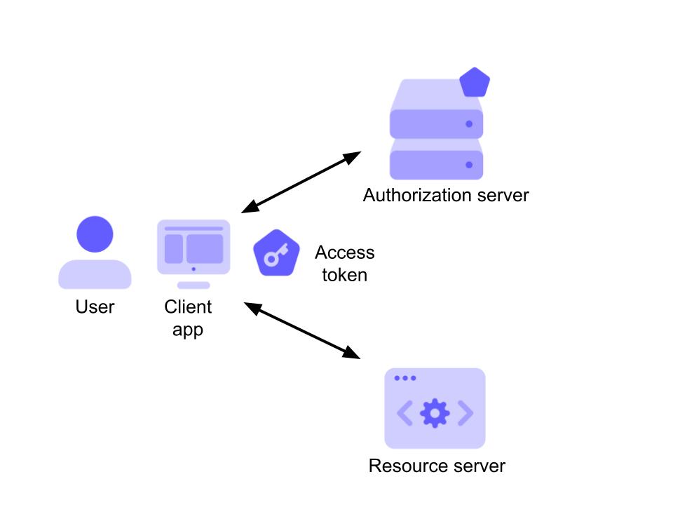

# Token

Beides kann als JWT-Token ausgeführt werden.

Zwischen ID und Access-Token besteht ein wesentlicher Unterschied in der Verwendung

## ID Token

* Der User wurde authentifiziert (OpenID)
* JWT!

Der ID-Token wird nicht von der Web-app zur API übertragen. Er bestätigt, dass der User für eine bestimmte Applikation angemeldet ist.

Enthält:

* Claims
  * Audience (Für welche App gilt der Token)
  * Issuer (Aussteller des Token)
  * Subject
  * Ablaufdatum
  * User-Info
  * ...
* Signed

User Infos können ohne Abfrage der DB in der App dargestellt werden. Dies ist möglich, weil dem Token, durch das signing, vertraut werden kann und daher auch dem Inhalt.

### Do's

* Setzt voraus, das der user angemeldet ist
* Enthält Profil-Infos des Users

### Dont's

* API-Call
* Check, ob der Client etwas abfragen darf.

## Access Token

* Die App wurde autorisiert (OAuth)
* JWT ode etwas beliebiges anderes
* Der ID-Token wird von der Web-App zur API übertragen.

Enthält:

* Claims
  * Audience (Für welche App gilt der Token)
  * Issuer (Aussteller des Token)
  * Subject
  * IAT (issued at time)
  * ...
  * Scopes (erlaubt/verbietet bestimmte Operationen (Read (eingeschränkt)/Write/Delete))

Sender Constraint: Der Token ist an einen bestimmten Sender (eindeutiger Client) gebunden.

## Ganz allgemein:

* Achtung! Jeder token kann gestohlen werden. (Api sollte mindestgens die Audience prüfen)
* ID-Tokens sollten Serverseitig gar nicht akzeptiert werden.
* Eine API sollte keinen Token akzeptieren, der nicht für diese bestimmt ist.
* Wenn man nur einen ID-Token verwendet, erlaubt man vielleicht Zugriffe, die man nicht haben möchte. (fehlende Scopes)
  
* Der Access-Token sollte nicht von Client untersucht und dessen Infos verwendet werden. Für den Client ist es ein KrzlBrzl-String.
* Das Access-Token-Format ist eine Vereinbarung zwischen Authorisation-Server und Resource-Server. Der Client sollte nicht "hineinfunken".

### Do's

* API-Call
* Check, ob der Client etwas abfragen darf.
* Inhalt wird Serverseitig inspiziert und damit Entscheidungen getroffen

### Dont's

* Inhalt wird Clientseitig inspizieren
