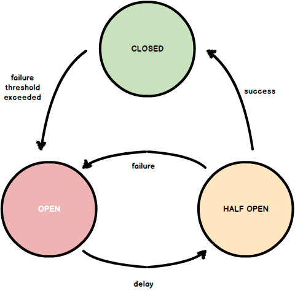
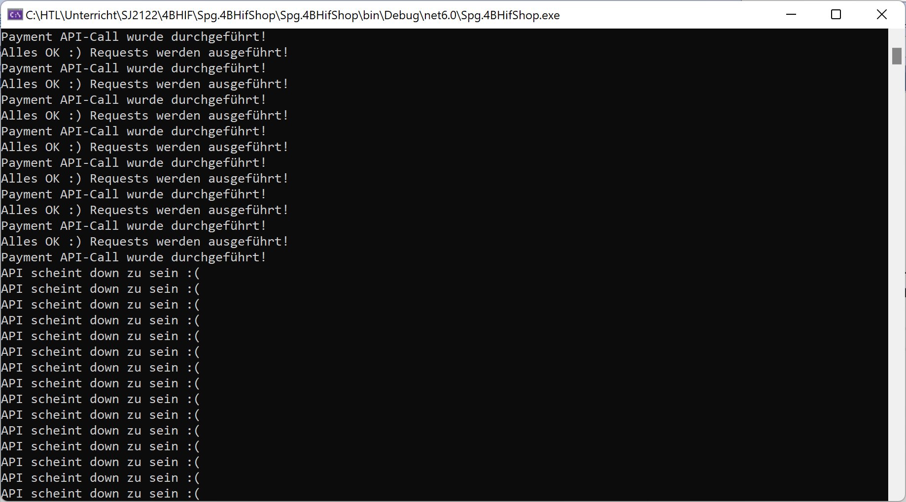

# Circuit Braeker Pattern

Dieses Pattern findet hauptsächlich in Mircro Services Anwendung, da in dieser Architekturform sehr viele Services (Web Services, APIs) ständig miteinander kommunizieren und daher das Datenaufkommen (Trafik) sehr hoch ist.



## Big Picture

In einem Webshop können Artikel gekauft werden. Die Artikel werden dabei in einen Warenkorb gelegt und müssen abschließend bezahlt werden. Für die Bezahlung wird die API eines Payment-Providers herangezogen (Sixt-Payment, MPay24, PayPal, ...). Der Webshop wird in einer Cloud (Azure, AWS, ...) gehostet.

Nehmen wir an die der Cloud-Provider verrechnet einige Cent pro Request. Nehmen wir ferner an, es ist vor Weihnachten und wir haben 1.000.000 Unique User in unserem Web Shop.

Wir können nicht davon ausgehen, dass die Payment-Api lückenos *up&running* ist. Es kann kurze Ausfälle geben (einige Sekunden, oder Minuten). Während dieser *Down Time* werden an die Payment-API Requests abgesetzt, die unserem Shop Geld kosten, die aber durch fehlende Verkäufe (die Payment-API ist ja gerade down) nicht hereingebracht werden können. Daher müssen während der Downtime der Payment-API die Requests unterdrückt werden. Haben wir 1.000.000 unique User, haben wir 1.000.000 Clicks. Die User können ja wissen, dass die API down. Es ist also davon auszugehen, das jeder Unique User wenigstens ein mal auf den Bezahl-Button clickt, also 1.000.000 Requests, die unnötig Geld kosten.

## Lösung

Der Circuit Brreaker unterbricht für eine bestimmte Zeit die Verbindung zur Payment-API absichtlich.

Das Circuit Breaker Pattern ist wesentlich in der modernen Softwareentwicklung. Es handelt sich dabei um eine State Machine, die ankommende Requests nicht weiterleitet, wenn der State *Open* ist. Ist der State *Closed* werden Requests durchgeführt.

Die Statemachine besteht aus 3 States.

* Closed: Alles ist OK! Die Payment-API ist *up&running*, Requests können durchgeführt werden.
* Open: Die API ist gerade nicht erreichbar, Requests werden unterdrückt. Der "Stromkreis" ist unterbrochen, er ist offen. Dieser Zustand wird für einen bestimmten Zeitraum (Time Out) beibehalten.
* HalfOpen: Nach einer bestimmten Zeit (Time Out) werden Requests wieder an die Payment-API gesendet um festzustellen, ob sie wieder erreichbar ist. Wenn ja, geht die State Machine in den State *Closed* zurück. Wenn nein, wird zu *Open* gewecvhselt, das Time Out beginnt von vorne zu laufen.

## Ablauf:

Es wird eine Time-Out-Länge und ein Treshold definiert. Treshold ist dabei die maximal Anzahl an Requests die eine Exception liefern dürfen, bevor der Circuit geöffnet wird. Ist dieser Wert erreicht, wird der Circiut geöffnet (State = *Open*). Nun beginnt ein Timer zu laufen (z.B. 1Min.). Nach Ablauf dieser Zeit, wechselt die State Machine in den State *HalfOpen* und versucht einen Request. Funktioniert dieser nicht, bleibt der *Closed*-State aufrecht und das Teimout beginnt erneut zu laufen. Ist er jedoch erfolgreich, wird in den *Closed*-State gewechselt. Nun laufen Request an die Paymewnt-API durch, bis eine weitere Down Time das API auftritt.

## Implementierung

Der Source Code ist diesem Kapitel angehängt. Ich beleuchte hier nur die wichtigsten Methoden:

### States

Die 3 State-Klassen (die ja den jeweiligen State abbilden), leiten von einer Basisklasse ab. Je nach State werden die 3 relevanten Methoden `ProtectedCodeIsExecuting`, `ProtectedCodeExecuted` und `ActOnException` überschrieben.

```C#
public class CircuitBreakerState
{
    protected readonly CircuitBreaker _circuitBreaker;

    protected CircuitBreakerState(CircuitBreaker circuitBreaker)
    {
        _circuitBreaker = circuitBreaker;
    }

    public virtual CircuitBreaker ProtectedCodeIsExecuting()
    {
        return _circuitBreaker;
    }

    public virtual void ProtectedCodeExecuted() 
    { }

    public virtual void ActOnException(Exception e)
    {
        _circuitBreaker.IncreaseFailureCount();
    }

    public virtual CircuitBreakerState Update()
    {
        return this;
    }
}
```

#### Closed State

Folgende Methode ist relevant:

```C#
public override void ActOnException(Exception e)
{
    base.ActOnException(e);
    if (_circuitBreaker.IsThresholdReached())
    {
        _circuitBreaker.MoveToOpenState();
    }
}
```

Ist der Circuit geschlossen und es tritt ein Fehler auf, muss reagiert werden. Wenn der Threshold-Wert erreicht wurde (das ist die maximale Anzahl an Fehlern, die "verziehen" werden), wird der State auf *Open* gesetzt.

Natürlich muss im Konstruktor der Failure-Counter zurückgesetzt werden, da ja alles OK ist.

``` C#
public ClosedState(CircuitBreaker circuitBreaker)
    : base(circuitBreaker)
{
    circuitBreaker.ResetFailureCount();
}
```

#### Open State

Für das Timeout wird im Konstruktor ein Zeitstempel gesetzt

```C#
public OpenState(CircuitBreaker circuitBreaker)
    : base(circuitBreaker)
{
    _openDateTime = DateTime.UtcNow;
}
```

Folgende Methjode ist relevant:

```C#
public override CircuitBreaker ProtectedCodeIsExecuting()
{
    base.ProtectedCodeIsExecuting();
    Update();
    return _circuitBreaker;

}
```

Es muss überprüft werden, ob ein Timeout abgelaufen ist um in den *HalfOpenState* zu wechseln *siehe Update()*

```C#
public override CircuitBreakerState Update()
{
    base.Update();
    if (DateTime.UtcNow >= _openDateTime + _circuitBreaker.Timeout)
    {
        return _circuitBreaker.MoveToHalfOpenState();
    }
    return this;
}
```

#### Half Open State

Nur wenn der State *HalfOpen* ist, kann sich der State auf *Closed* ändern. 
* Beim State *Open* werden States auf jeden Fall verweigert. Der Curcuit ist ja geöffnet. (keine State-Änderung).
* Wenn der State *Closed* ist, ist alles gut. Requests normal verarbeitet. (keine State-Änderung). Darum wird diese Methode nur in dieser! Klasse überschrieben.

```C#
public override void ProtectedCodeExecuted()
{
    base.ProtectedCodeExecuted();
    _circuitBreaker.MoveToClosedState();
}
```

Tritt keine Exception auf, wird der State auf *Open* geändert

```C#
public override void ActOnException(Exception e)
{
    base.ActOnException(e);
    _circuitBreaker.MoveToOpenState();
}
```

#### CircuitBraeker.cs

Nun zur eigentlichen "Haupt-Klasse":

Folgende Methode führt die State-Änderungen durch

```C#
public CircuitBreaker AttemptApiCall<TException>(Action protectedCode)
    where TException : Exception, new()
{
    _exceptionFromLastAttemptCall = default!;
    lock (_monitor)
    {
        _state.ProtectedCodeIsExecuting();
        if (_state is OpenState)
        {
            return this; // Code wird nicht weiter ausgeführt
        }
    }
    try
    {
        protectedCode();
    }
    catch (TException e)
    {
        _exceptionFromLastAttemptCall = e;
        lock (_monitor)
        {
            _state.ActOnException(e);
        }
        return this; // Code wird nicht weiter ausgeführt
    }

    lock (_monitor)
    {
        _state.ProtectedCodeExecuted();
    }
    return this;
}
```

### Aufruf

Wie wird das Pattern nun verwendet? Wir erstellen dazu einen winzigen "Pseudo"-WebShop, der den Circuit Breaker verwendet. Der Shop ruf eine eine Klasse und Methode auf, die einen instabilen Zustand simuliert, in dem in regelmäßigen Absständen (ist so implementiert) eine Exception geworfen wird.

#### Das Pattern verwenden

Wie bereits oben ersichtlich, bekommt die Methode `AttemptApiCall` eine `Action` als Parameter(Type), es wird also die eigentliche Logik zum *callen* der API injected. (siehe Delegates)

``` C#
public IActionResult CallPayment()
{
    if (_circuitBreaker.AttemptApiCall<ApiNotReachableException>(_paymentApiWebService.DoPaymentApiCall).IsClosed)
    {
        Console.WriteLine("Alles OK :) Requests werden ausgeführt!");
    }
    else
    {
        Console.WriteLine("API scheint down zu sein :(");
    }
    return View();
}
```

#### Eine instabile API simulieren

Dieser Teil wird durch den Aufruf einer Methode in einer belibigen Klasse simuliert. Die Methode wirft in regelmäßigen Abständen eine Exception, die den Circuit Breaker auslößt, und zum State *Open* wechseln lässt.

In der Konsole lässt sich mittels `Console WrilteLine`'s das Verhalten anschließend beobachten.

```C#
public class PaymentApiWebService
{
    private int _calls = 0;

    public void DoPaymentApiCall()
    {
        _calls++;
        Console.WriteLine("Payment API-Call wurde durchgeführt!");

        for (int i = 0; i < 1000; i++)
        { }

        if (_calls % 10 == 0)
        {
            throw new ApiNotReachableException("Payment API is temporarily down! Please wait...");
        }
    }
}
```

### Registrieren der Services

Die Services werden als Sigleton registriert. Dies ist notwenig, da sowohl Teimeout, als auch Threshold gespeichert werden müssen, also einen State darstellen. Da das Pattern die gesammte Applikation betrifft, und eine instabile API alle Instanzen meiner Applikation beeinflussen, ist ausnahmsweise ein Singleton vertretbar. 

(Achtung!! beim Umgang mit dem Sinlegon-Pattern. Man kann hier leicht in Concurrency-Probleme geraten)

```C#
builder.Services.AddSingleton<ICircuitBreaker, CircuitBreaker>(s => new CircuitBreaker(3, new TimeSpan(0, 1, 0)));
builder.Services.AddSingleton<PaymentApiWebService>();
```

### Verhalten / Fazit

Wird die Applikation gestartet, ist erstmal alles in Ordnung. Klickt man nun auf Bezahlen und aktualisiert die diese Seite öfter `F5` (das soll mehrere Unique User simulieren), wird nach **n** Klicks die Exception geworfen. Der Circuit wird geöffnet und Requests werden für einen definierten Zeitraum (Timeaout) nicht mehr an die API weitergeleitet. Danach wechselt der State zu *HalfOpen*. Wenn die API anschließend stabil läuft, wieder zum State *Closed*.


