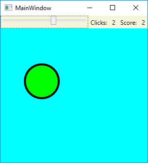

# Starten mit WPF: Catch the Ball

Im folgenden Beispiel muss einfach nur der Kreis mit der Maus getroffen werden. Das ist von
der Spielelogik her natürlich sehr stumpfsinnig, es zeigt aber schon die wesentlichen Bestandteile zum Erstellen
von Benutzeroberflächen mit WPF (Windows Presentation Foundation) in XAML:
- Container (Grid, DockPanel, StackPanel, Canvas)
- Controls (Label, Slider, Ellipse) und ihre Attribute
- Eventhandler
- Binding von Attributswerten an andere Controls

Im Code Behind wird folgendes gezeigt:
  - Eventhandler
  - Dynamisches Ändern von Controls
  - Dynamisches Erstellen von Controls
 