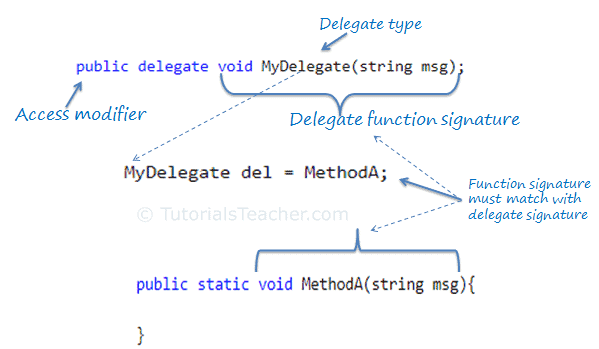

# Delegates

Delegates helfen dabei, die Programmlogik weiter zu entkoppeln. Entkoppelung haben wir bereits beim Thema Depenenzy Injection kennengelernt. Verwendet man Delegates kann man so zu sagen Logik als Parameter einer Methode übergeben. Die Methode ruft also nicht mehr eine Methode außerhalb auf, sondern die äußere Logik (Methode) wird der Methode als Parameter mitgegeben und führt die Logik darin dann aus.

Man kann also sagen: **Delegates übergeben Funktion als Parameter**

## Übersicht



## Delegates als Parameter

Das ist die häufigste Anwendung für Delegates.

Sehen wir uns folgendes Beispiel an:

```C#
public class OldSchool
{
    /// <summary>
    /// Diese Methode hat den Nachteil, dass der Vergleich fix gecodet ist.
    /// Möchte ich auf != vergleichen, muss ich die Methode ändern.
    /// </summary>
    /// <param name="x"></param>
    /// <param name="y"></param>
    /// <returns></returns>
    public bool GreatMethodForNearlyEverything(int x, int y)
    {
        // ...
        // 1000 Zeilen Code (z.B. irgendweche Vorbereitungen werden duhgeführt)
        // ...

        bool result = CompareEqual(x, y);

        // ...
        // 1000 Zeilen Code (z.B. result wird irgendwie verarbeitet)
        // ...

        return result;
    }

    public bool CompareEqual(int x, int y)
    {
        return (x == y);
    }
    public bool CompareNotEqual(int x, int y)
    {
        return (x != y);
    }

    public void DoSomeWork()
    {
        bool result = GreatMethodForNearlyEverything(5, 5);

        Console.WriteLine(result);
    }
}
```

Es wird die Methode ``GreatMethodForNearlyEverything`` aufgerufen. Nehmen wir an, diese Methode ist sehr umfangreich und könnte so für eine große Anzahl an Projekten eingesetzt werden. Leider aber muss eine Prüfung darin (``bool result = CompareEqual(x, y);``) für jeden neuen Einsatz geändert werden. Mal nöchte man auf gleichheit, mal auf ungleichheit, mal auf kleiner, mal auf größer, ... prüfen. Die Zeile in der Methode muss also immer geändert werden. Das ist nicht gut, besser wäre es eine Lösung zu entwickeln in der diese Zeile nicht geändert werden muss und trotzdem unterschiedliche Vergleiche durchgeführt werden können.

## Ein Delegates

Delegates sind hierfür eine Lösung.

```C#
public class WithDelegate
{
    public delegate bool CompareHandler(int x, int y);

    /// <summary>
    /// Die Lösung ist ein Delegate. Hier wird der Methode die Logik
    /// zum Vergleichen als Parameter mitgegeben. Ein Stück Logik
    /// wird über den Parameter in die Methode gegeben und dort 
    /// ausgeführt.
    /// </summary>
    /// <param name="handler">Die Methode welche die Vergleichslogik erhält</param>
    /// <param name="x"></param>
    /// <param name="y"></param>
    /// <returns></returns>
    public bool GreatMethodForNearlyEverything(CompareHandler handler, int x, int y)
    {
        // ...
        // 1000 Zeilen Code (z.B. irgendweche Vorbereitungen werden duhgeführt)
        // ...

        bool result = handler(x, y);

        // ...
        // 1000 Zeilen Code (z.B. result wird irgendwie verarbeitet)
        // ...

        return result;
    }

    public bool CompareEqual(int x, int y)
    {
        return (x == y);
    }
    public bool CompareNotEqual(int x, int y)
    {
        return (x != y);
    }

    public void DoSomeWork()
    {
        bool result = GreatMethodForNearlyEverything(CompareNotEqual, 5, 5);

        Console.WriteLine(result);
    }
}
```

Wir erstellen ein Delegate mit dem Namen ``CompareHandler`` und verwenden dieses Delegate als Datentyp für einen weiteren Parameter der Methode ``GreatMethodForNearlyEverything``.

Nun können wir jede Methode an dieses Delegate übergeben, die die gleiche Signatur hat, wie das Delegate. Also in unserem Fall:

```C#
bool CompareEqual(int x, int y)

bool CompareNotEqual(int x, int y)

...
```

Innerhalb der Methode ``GreatMethodForNearlyEverything`` wird nun nicht mehr eine Methode mittels Namen direkt aufgerufn, sondern das Delegate ausgeführt. Das Delgate wiederum fürhrt jene Methode aus, die wir ihm übergeben haben. In unserem Fall ``CompareNotEqual``.

Also auch hier findet eine Umkehrung der Logik (Inversion of Control) statt. Nicht eine Methode ruft von sich aus, ein anderes Stück Logik auf (eine andere Methode), sondern das Stück Logik wird der ursprünglichen Methode beim Aufruf mitgegeben.
