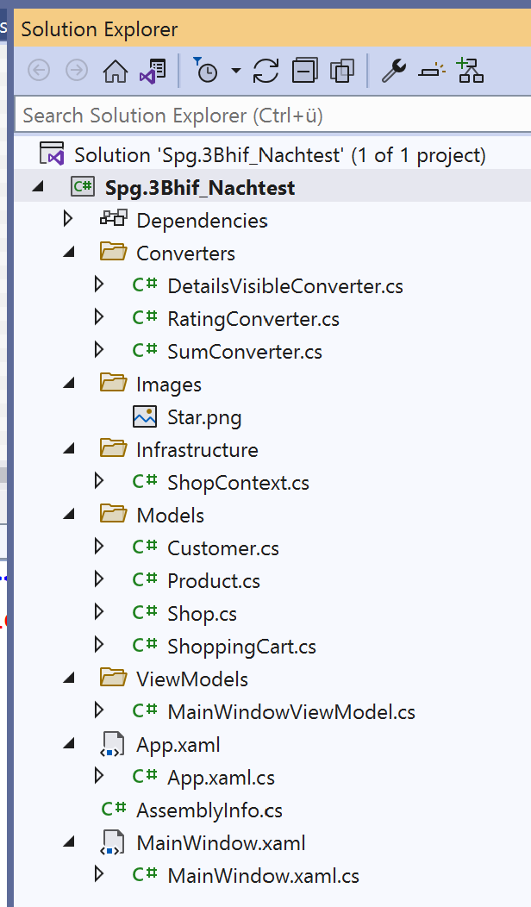
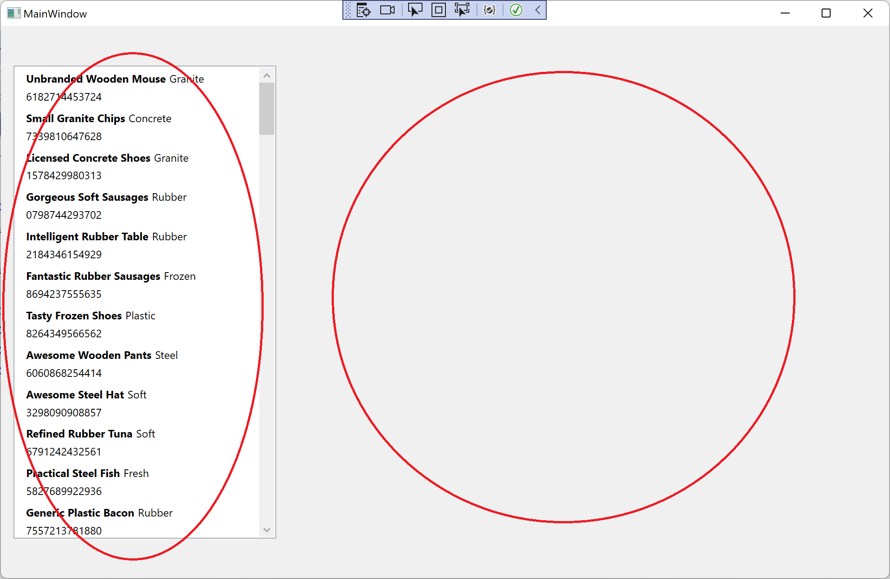
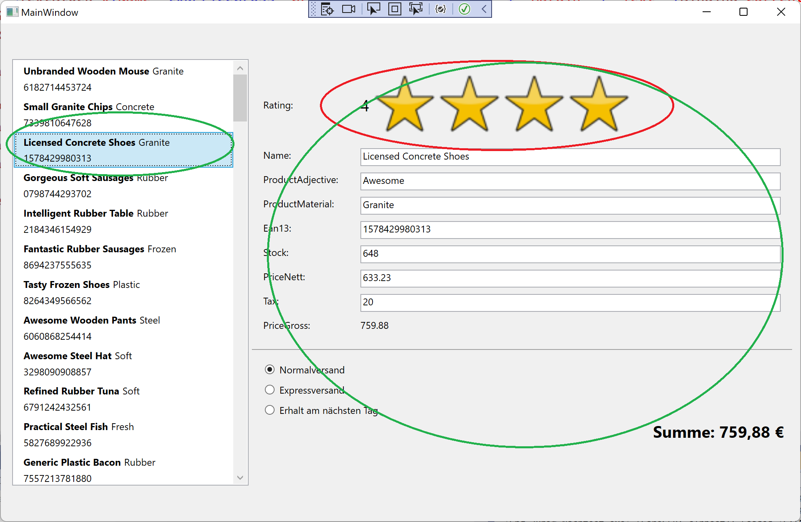
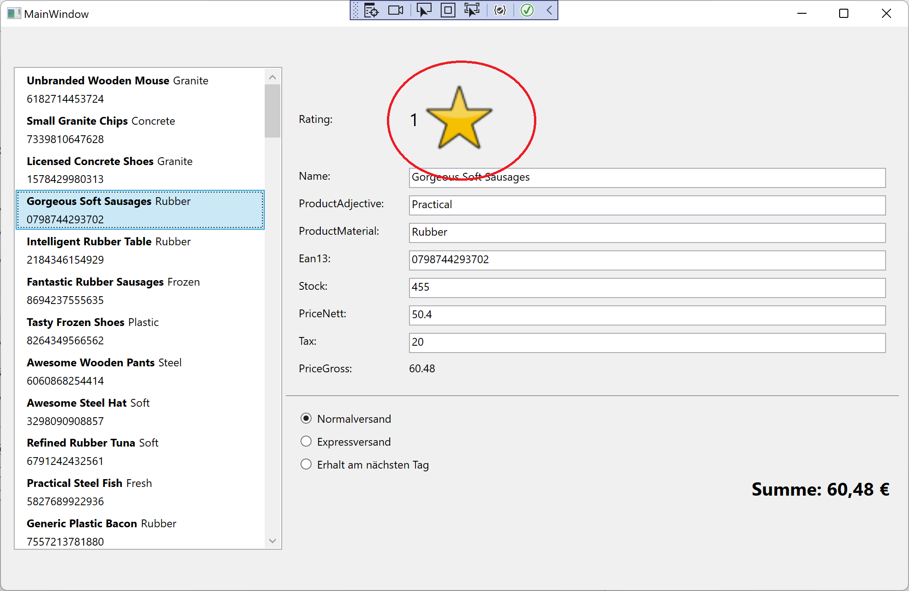
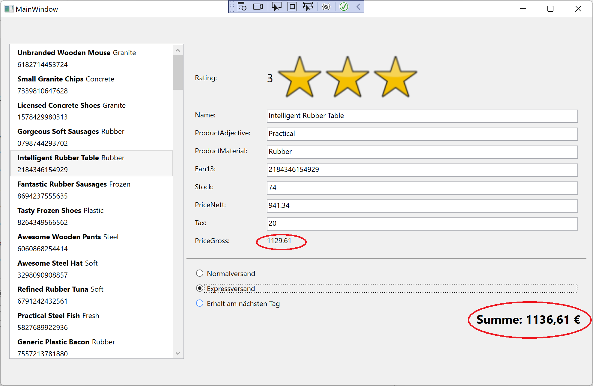

# Test

Erstelle bitte eine WPF-Applikation. Ziel ist es für mich festzustellen, wie gut du folgende Konzepte umsetzten kannst:

* XAML
* MVVM (Model-View-ViewModel)
* Datenbankanbindung
* Converter / MultiConverter

## Die App

Programmiere eine simple App zur Verwaltung von Produkten.

1. Erstelle eine Solution mit einem WPF-Projekt und erstelle alle notwendigen Klassen um folgende Projektstruktur zu erhalten. (Das Image (*.png) kannst du in unserem Team downloaden)



Um dir die Arbeit zu erleichtern kannst du für den Namespace Models folgende Code-Snippets verwenden:

```C#
public enum Genders { Male, Female }
public class Customer
{
    protected Customer()
    { }
    public Customer(Genders gender, string firstName, string lastName, string eMail)
    {
        Gender = gender;
        FirstName = firstName;
        LastName = lastName;
        EMail = eMail;
    }

    public int Id { get; private set; }
    public Genders Gender { get; set; }
    public string FirstName { get; set; } = string.Empty;
    public string? LastName { get; set; }
    public string? EMail { get; set; }

    private List<ShoppingCart> _shoppingCarts = new();
    public IReadOnlyList<ShoppingCart> ShoppingCarts => _shoppingCarts;

    public void AddShoppingCarts(List<ShoppingCart> shoppingCarts)
    {
        _shoppingCarts.AddRange(shoppingCarts);
    }
}
```

```C#
public class Product
{
    protected Product() { }
    public Product(string name, string productAdjective, string productMaterial, string ean13, int stock, decimal priceNett, int tax, Shop shop)
    {
        Name = name;
        ProductAdjective = productAdjective;
        ProductMaterial = productMaterial;
        Ean13 = ean13;
        PriceNett = priceNett;
        Tax = tax;
        Stock = stock;
    }
    public int Id { get; set; }
    public string Name { get; set; }
    public string ProductAdjective { get; set; }
    public string ProductMaterial { get; set; }
    public string Ean13 { get; set; }
    public int Stock { get; set; }
    public decimal PriceNett { get; set; }
    public int Tax { get; set; }
    public decimal PriceGross => PriceNett * 1.2M; 
    public int Rating { get; set; }

    public int ShopNavigationId { get; set; }
    public Shop ShopNavigation { get; set; }
}
```

```C#
public class Shop
{
    protected Shop() { }
    public Shop(string companySuffix, string name, string location, string catchPhrase, string bs, Guid guid)
    {
        CompanySuffix = companySuffix;
        Name = name;
        Location = location;
        CatchPhrase = catchPhrase;
        Bs = bs;
        Guid = guid;
    }

    public int Id { get; set; }
    public string CompanySuffix { get; set; }
    public string Name { get; set; }
    public string Location { get; set; }
    public string CatchPhrase { get; set; }
    public string Bs { get; set; }
    public Guid Guid { get; private set; }

    private List<Product> _products = new();
    public IReadOnlyList<Product> Products => _products;

    public void AddProducts(List<Product> products)
    {
        _products.AddRange(products);
    }
}
```

```C#
public enum States { Active, Sold}
public class ShoppingCart
{
    protected ShoppingCart() { }
    public ShoppingCart(Guid guid, Customer customer)
    {
        Guid = guid;
        CustomerNavigation = customer;
    }

    public int Id { get; set; }
    public States State { get; set; }
    public Guid Guid { get; set; }

    public int CustomerId { get; set; }
    public Customer CustomerNavigation { get; private set; }
}
```

```C#
public class ShopContext : DbContext
{
    public ShopContext()
    { }

    public ShopContext(DbContextOptions options)
        : base(options)
    { }

    public DbSet<Shop> Shops => Set<Shop>();
    public DbSet<Product> Products => Set<Product>();
    public DbSet<ShoppingCart> ShoppingCarts => Set<ShoppingCart>();
    public DbSet<Customer> Customers => Set<Customer>();

    protected override void OnConfiguring(DbContextOptionsBuilder optionsBuilder)
    {
        if (!optionsBuilder.IsConfigured)
        {
            optionsBuilder.UseSqlite(@"Data Source=Nachtest.db");
        }
    }

    public void Seed()
    {
        Randomizer.Seed = new Random(1313);

        // Customer
        List<Customer> customers = new Faker<Customer>("de").CustomInstantiator(f =>
        new Customer(Genders.Female, f.Name.FirstName(), f.Name.LastName(), f.Internet.Email()))
        .Generate(1000)
        .ToList();
        Customers.AddRange(customers);
        SaveChanges();

        // Shops
        List<Shop> shops = new Faker<Shop>("de").CustomInstantiator(f =>
        new Shop(f.Company.CompanySuffix(), f.Company.CompanyName(), f.Address.StreetAddress(), f.Company.CatchPhrase(), f.Company.Bs(), Guid.NewGuid()))
        .Rules((f, s) =>
        {
            // Products pro Shop
            List<Product> products = new Faker<Product>("de").CustomInstantiator(f =>
            new Product(f.Commerce.ProductName(), f.Commerce.ProductAdjective(), f.Commerce.ProductMaterial(), f.Commerce.Ean13(), f.Random.Int(20, 1000), f.Random.Decimal(10, 999), 20, s))
            .Rules((f, p) =>
            {
                p.Rating = f.Random.Int(1, 5);
            })
            .Generate(f.Random.Int(15, 25));
            s.AddProducts(products);
            SaveChanges();
        })
        .Generate(5)
        .ToList();
        Shops.AddRange(shops);
        SaveChanges();

        // ShoppingCarts
        List<ShoppingCart> shoppingCarts = new Faker<ShoppingCart>("de").CustomInstantiator(f =>
        new ShoppingCart(f.Random.Guid(), f.Random.ListItem(customers)))
        .Rules((f, s) =>
        {
            Customer owner = s.CustomerNavigation;
            s.State = States.Sold;
        })
        .Generate(10)
        .GroupBy(t => t.Guid)
        .Select(g => g.First())
        .ToList();
        ShoppingCarts.AddRange(shoppingCarts);
        SaveChanges();
    }
}
```

**ACHTUNG** Installiere die notwendigen NuGet-Packages: (Manage *NuGet-Packages* im Solution-Explorer)

```PowerShell
Microsoft.EntityFrameworkCore.Sqlite
Microsoft.EntityFrameworkCore.Tools
Bogus
```


1. Erstelle die ``ViewModel``-Klasse

Dafür kannst du im Konstruktor folgendes Code-Snippet verwenden, wenn du möchtest. Erinnere dich an das vergangene Semester. Dort habe wir ein ähnliches Snippet in einem Unit Test verwendet, um eine DB zu erstellen. (Das 'seeden' haben wir noch nicht gemacht)

```C#
DbContextOptions options = new DbContextOptionsBuilder()
    .UseSqlite("Data Source=Plue03.db")
    .Options;
_db = new AddressBookContext(options);
_db.Database.EnsureDeleted();
_db.Database.EnsureCreated();
_db.Seed();
```

Es erstellt eine neue Datenbank und befüllt diese mit Daten. Dafür ist die ``Seed()``-Methode zuständig.

Das ViewModel soll nun alle notwendigen Properties enthalten um anschließend in einer Liste die Kontakte (``Person``'s) aufzulisten.

3. XAML

Ab hier ist wirklich dein KnowHow gefordert. Erstelle eine WPF-Applikation, die in der Lage ist, die Produktdaten aus der Datenbank in einer Liste darzustellen.

Die App hat folgende Anforderungen:

* Eine Liste listet alle Produkte aus der Datenbank auf
* Es sollen zu mindestens (Produktname, Material und der EAN-Code (Bar-Code)) dargestellt werden. Verwende dafür Elemente, weche die Darstellung "ansehlich" gestalten.
* Klickt man auf ein Produkt werden in Textboxen die Details des Produkts dargestellt.
* Die Detaildaten sollen mit Labels versehen werden.
* Es sollen alle Daten eines Produkts dargestellt werden.
* Weiters sind unterhalb der Daten 3 Radio-Buttons anzubringen, über die eine Versandart ausgewählt werden kann.
 * Versandarten: (*Normalversand*, *Expressversand* und *Erhalt am nächsten Tag*)

* Bonus (das haben wir noch nicht gelernt): Versuche einen geänderten Datensatz in der Datenbank zu aktualisieren.

Folgende Screenshots helfen dir bei der Gestaltung der Darstellung:

**Screen Shot 1**


**Screen Shot 2**


**Screen Shot 3**


**Screen Shot 4**


1. Converter 

**Multiconverter:**
Der Multiconverter soll den Preis des ausgewählten Produktes und die ausgewählte Versandart (Radio-Buttons) errechnen und darstellen (siehe Screen Shot 4)

**Details-Converter**
Der Details Converter soll bestimmen, ob die Detaildaten angezeigt werden sollen. Ist nämlich kein Produkt ausgewählt, sollen die Textfelder und Labels gar nicht angezeigt werden (siehe Screen Shot 1 und 2).

**Rating-Converter**
Der rating-Converter soll das int-Feld ``Rating`` Visuell gestalten. Das Feld enthält einen Wert zwischen 1 und 5. Statt der zahl sollen 1 bis 5 Sterne dargestellt werden, wie man das vielleicht von z.B. Amazon-Rezessionen kennt.
**ACHTUNG!!** Es ist lediglich ein PNG-File eines einzelnen Sterns gegeben. Überlege dir einen Algorithmus, wie du diesen vervielfachen und in einer Reihe darstellen kannst, so das sich eine Sternenreihen von einem bis fünf Sternen ergibt (Nebeneinander oder Untereinander = egal).
(siehe Screen Shot 2, 3, 4)

##Notenschlüssel:

**4**
Das Projekt muss angelegt und alle notwendigen Klassen vorhanden sein. Das XAML muss vollständig ausgeführt sein.

**3**
Die Liste muss korrekt befüllt werden und die Detaildaten müssen nach klick auf einen Eintrag sichtbar sein.
Der Converter zur Anzeige der Detaildaten muss vorhanden sein und funktionieren.

**2**
Der Rating-Converter muss vorhanden sein und funktionieren.

**1**
Alle Converter müssen vorhanden sein und funktionieren.

**Ich wünsche dir !Gutes Gelingen!**